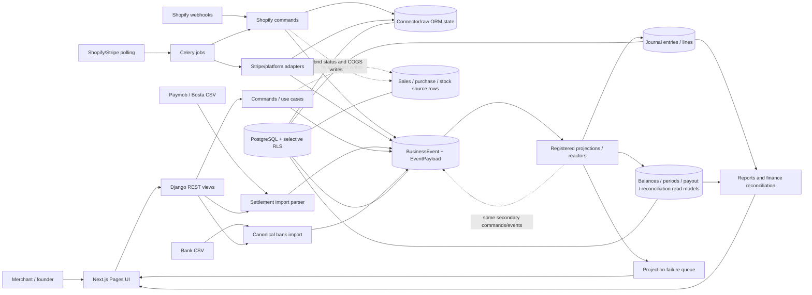
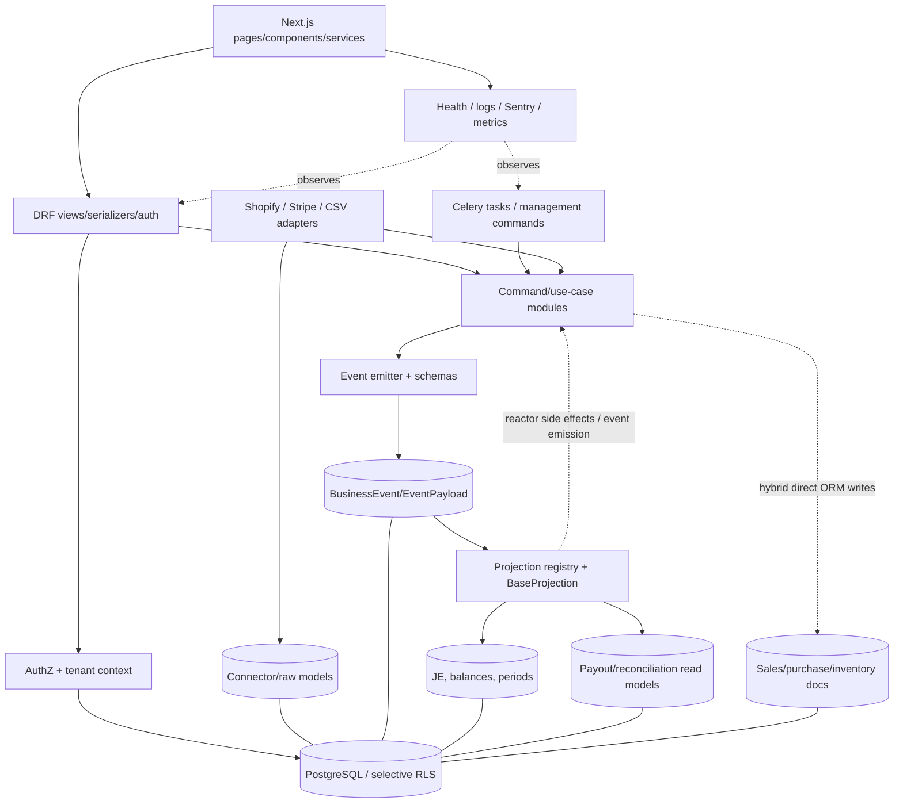

# Nxentra Current-State, Architecture, Product-Wedge, and Readiness Audit

**Audit date:** 2026-07-18

**Audited revision:** `main` at `bfb09fa34ea08554483e57f5de65ddd5d4d9a8d0`

**Audit mode:** independent, evidence-based, audit-only; no application code was changed

**Readiness-model amendment (2026-07-23):** sections 1, 17, 20, 21, 22, 26 and the direct answers were revised to carry **one internally consistent readiness model with two distinct deployment contracts** — a standard/shared pilot (unchanged **NO-GO**) and a constrained isolated shadow-ledger pilot (**CONDITIONAL GO** under the narrower **A1–A5 + G1–G2** gate defined in section 21). The audited revision remains pinned to `bfb09fa`; no application code was changed in this amendment; the private-beta (section 18) and GA (section 19) requirements were **not** relaxed.

**Evidence labels:** **VERIFIED FACT** = demonstrated by current code/config/tests/commands; **REASONABLE INFERENCE** = best conclusion from several facts; **UNVERIFIED CLAIM** = stated in repository material but not demonstrated; **UNKNOWN** = repository cannot answer; **CONTRADICTION** = current evidence disagrees.

## 1. Executive verdict

**Current stage: Founder-operated alpha.**

**Recommendation — one readiness model, two deployment contracts:**

- **Standard / shared-infrastructure pilot: NO-GO** at this revision. The broad P0 list (section 22, steps 1–10) — full tenant-denial RLS, complete RBAC, safe rebuild v2, safe restore, canonical bank controls — is unmet, and a shared-database deployment re-exposes every one of those surfaces.
- **Constrained isolated shadow-ledger pilot: CONDITIONAL GO**, achievable on this revision once five code blockers (**A1–A5**) and two operational gates (**G1–G2**), defined in section 21, are evidenced. This contract is safe only because four constraints structurally remove whole risk classes rather than papering over them: **one merchant per fully isolated deployment** (database, credentials, background-job scope, cache, files, backups and admin access — not merely a distinct `Company` row) neutralizes cross-tenant exposure; **a single owner/admin account with no invitations** neutralizes the RBAC-escalation surface; **rebuild disabled at every entry point** neutralizes the rebuild-corruption class; and **shadow-only reliance with founder control-total reconciliation** bounds the blast radius of any residual defect. What those constraints cannot neutralize — request forgery, silent security-disable at boot, a silently-corruptible ledger, auto-firing payout/inventory side effects, and silent-return money handlers — is exactly what A1–A5 fix, and what G1–G2 prove end-to-end.

Synthetic demonstrations and engineering tests can continue regardless. Neither contract may be called "accounting truth" until the proof chain (G1) covers negative paths and recovery (G2), not merely the happy path. The private-beta and GA bars (sections 18–19) are unchanged.

- **VERIFIED FACT — real product exists:** Nxentra is not a mock. It contains a functioning double-entry accounting core, immutable application-level `BusinessEvent` records, CQRS-style projections, Shopify ingestion, Stripe ingestion, Paymob/Bosta settlement CSV adapters, canonical bank reconciliation, exception surfaces, reports, backups, GDPR jobs, and a substantial frontend. The broad SQLite suite passed 1,343 tests; 238 frontend tests and the production frontend build also passed.
- **VERIFIED FACT — current safety gate is false:** active money paths still discard or misstate results without reaching the exception queue, though the branches differ in severity. In Shopify refund handling: a credit-note creation failure logs at **error** level and returns with the event already stamped applied (`backend/shopify_connector/projections.py:~1278`) — a genuine silent financial loss; a missing `SALES_REVENUE` mapping (`~1163`) and an orphan invoice older than 24h (`~1203`) log at **warning** level and return (fresh <24h orphan invoices `raise DeferEvent` and self-heal on retry); and a restock failure (`~1651`) logs a warning **after** the restock JE/GL has already posted, i.e. a GL-vs-subledger stock divergence rather than a pure money loss. Separately, negative Shopify Payments payouts are sign-flipped through `abs()` (`:1668-1697`); canonical bank import can drop invalid rows; and COGS/stock failures can become unretryable. These paths contradict the checked claims at `NEXT_TASKS.md:15-28`.
- **VERIFIED FACT — two newly confirmed P0s:** (1) cookie JWT authentication accepts `SameSite=None` cookies without enforcing CSRF (`backend/accounts/authentication.py:22-48`; `backend/nxentra_backend/settings.py:313-327`); (2) `BaseProjection.rebuild()` clears state and deletes applied markers in separate preparation steps, so a crash can leave empty data whose events are subsequently skipped while lag reaches zero (`backend/projections/base.py:135-155,248-258`).
- **VERIFIED FACT — the truth-engine claim is narrower than the codebase claim:** the ledger, balances, periods, and reconciliation lifecycle are substantially event-derived, but sales/purchase documents, stock ledger/FIFO layers, inventory transfers, and connector operational state are hybrid/direct-written (`backend/sales/apps.py:5-10`; `backend/purchases/apps.py:5-10`; `backend/inventory/apps.py:10-12`).
- **REASONABLE INFERENCE — strongest wedge:** a supervised month-close and money-movement proof for single-store Egyptian Shopify merchants using EGP plus Paymob and/or Bosta settlement CSVs and bank CSVs. The repository supports this proposition **partially**, not fully, because the data path exists but its failure controls are not yet trustworthy.
- **UNKNOWN — commercial proof:** current active merchants, retention, paid demand, MRR, willingness to pay, real-world match rates, live Shopify scopes, and production worker/backup/monitor state cannot be established from this repository.

The architecture is worth repairing. A rewrite is not justified. The correct move is to narrow the product contract, close a small number of foundational integrity/security holes, prove one real month for three design partners, and stop expanding the platform until the wedge has customer evidence.

## 2. Current repository snapshot

| Item | Evidence-based snapshot |
|---|---|
| Date / branch / revision | **VERIFIED FACT:** 2026-07-18; `main`; `bfb09fa34ea08554483e57f5de65ddd5d4d9a8d0`; local branch aligned with `origin/main` at capture time. |
| Worktree | **VERIFIED FACT:** dirty before the audit: user-owned `frontend/next-env.d.ts` change plus untracked test ZIP/CSV/submission assets. The audit preserved them. This report is the only intentional repository deliverable. |
| Scale | **VERIFIED FACT:** 1,187 tracked files; 698 tracked Python files; 368 tracked TypeScript files; 160 migrations; 203 test files by filename inventory; 172 Pages-Router `.tsx` pages; largest backend files exceed 5,000 physical lines. |
| Backend | **VERIFIED FACT:** Python 3.12.6 locally; Django 4.2.28, DRF 3.16.0, Celery 5.6.2; CI uses Python 3.11 (`.github/workflows/ci.yml`). |
| Frontend | **VERIFIED FACT:** Next.js 14.2.35 Pages Router, React 18.2, TypeScript 5.3, Tailwind/shadcn-style components; local Node 22.20/npm 10.9; Docker uses Node 20; CI uses Node 18. |
| Database | **VERIFIED FACT:** PostgreSQL is the intended production database; selective `FORCE ROW LEVEL SECURITY` migrations exist. Test settings also support SQLite. Local PostgreSQL 16.3 was reachable. |
| Background work | **VERIFIED FACT:** Celery worker + django-celery-beat + Redis; production requires synchronous projections and asserts `PROJECTIONS_SYNC=True` (`backend/nxentra_backend/settings.py:96-113`). |
| Major applications | **VERIFIED FACT:** accounts/tenant, accounting, events, projections, reconciliation, sales, purchases, inventory, Shopify, Stripe, platform connectors, legacy bank connector, backups, EDIM, scratchpad, properties, clinic, and ops. |
| Test frameworks | **VERIFIED FACT:** pytest/pytest-django, Vitest/Testing Library/MSW, and Playwright. Coverage is not configured as a gate. |
| CI | **VERIFIED FACT:** broad SQLite backend job; PostgreSQL invariant/concurrency job; PostgreSQL E2E job; Vitest/build; Ruff lint/format; canonical-spine mypy; architecture tests; deploy/migration checks; npm critical-only audit; aggregate quality gate (`.github/workflows/ci.yml:35-312`). |
| Deployment artifacts | **VERIFIED FACT:** backend/frontend Dockerfiles; development-oriented `docker-compose.yml` with PostgreSQL, Redis, API, worker, beat, projection consumer, frontend, Prometheus, Alertmanager; frontend deploy script/runbook. No equivalent repository-controlled atomic backend deployment/rollback workflow was found. |
| Key documentation | `README.md`, `NXENTRA_SYSTEM_MAP.md`, `NEXT_TASKS.md`, `TASKS_DONE.md`, `SESSION_LOG.md`, `docs/finance_event_first_policy.md`, `docs/design-principle-operator-safety.md`, ADR-0001/0002, ops/security runbooks, `docs/testing/fresh_merchant_e2e.md`, and the 2026-07-17 operator-safety retro-audit. |

**CONTRADICTION:** `README.md:3-8` describes a broad “Smart ERP Platform,” while current roadmap language and the most coherent UI/data path are reconciliation-first. `docs/finance_event_first_policy.md:17-40` describes broader event reconstructibility than the implementation provides.

## 3. What Nxentra actually does today

### One sentence for a merchant

**VERIFIED FACT:** Nxentra imports Shopify activity, provider settlement data, and bank statements, then creates accounting entries and a staged reconciliation view intended to answer “where is my money?”

### One paragraph for a technical buyer

**VERIFIED FACT:** Nxentra is a multi-company Django/Next.js accounting application with a PostgreSQL-backed event ledger and projection-built financial read models. It has real Shopify and Stripe adapters, provider-neutral payout/settlement structures, Paymob/Bosta CSV ingestion, expected-bank-deposit accounting, bank matching, exception handling, period controls, reports, and operational endpoints. **Qualification:** the system is hybrid rather than comprehensively event-sourced, several active financial failures are silent, tenant/security enforcement is incomplete, and recovery is not safe enough to call it an authoritative unattended ledger.

### One paragraph for an engineer joining the project

**VERIFIED FACT:** UI requests enter DRF views, usually call command functions, emit typed `BusinessEvent`s through `events/emitter.py`, and synchronously apply registered projections to accounting/reconciliation read models. Celery performs provider polling, backfill, GDPR, projection, and operational tasks. The intended boundaries are visible in Django apps, command modules, projections, a write barrier, permission helpers, tenant context, and architecture tests. **Qualification:** large command/view modules combine orchestration and domain logic; some projections are also reactors that emit or create secondary effects; sales/purchase/inventory source documents remain direct ORM state; and two bank/reconciliation products overlap.

### What Nxentra is not

**VERIFIED FACT:** Nxentra is **not** yet a generally available, self-service, fully replayable, independently security-assured accounting system, nor does this repository prove that it has paying-market demand.

### Current financial sources of truth

| Area | Current authority | Rebuild status |
|---|---|---|
| Event identity, journal lifecycle, balances, fiscal periods, reconciliation state | `BusinessEvent` plus projection state | Substantially event-derived, but rebuild orchestration is unsafe and some projection handlers have side effects. |
| Sales/purchase documents and credit notes | Direct-written ORM documents plus associated events/JEs | Hybrid; no sales/purchases projection registration (`sales/apps.py`, `purchases/apps.py`). |
| Stock ledger, FIFO layers, transfers | Direct command-owned ORM rows plus inventory events; only `InventoryBalance` is registered as a projection | Not fully reconstructible and known to diverge after void/rebuild. |
| Shopify/Stripe operational records and raw inputs | Connector ORM tables, raw payload/cache records, and normalized events | Mixed; status/link fields may not be event-reconstructible. |
| Backups | Application ZIP export plus external managed-PostgreSQL claims | Application restore is tested in a narrow drill, but stale restore/API-key/private-storage defects remain. |

**REASONABLE INFERENCE:** Nxentra currently has several cooperating truth sources, not one repo-wide financial source of truth. `BusinessEvent` is the strongest authority for the ledger/reconciliation lifecycle, but not for the complete ERP state.

## 4. Actual end-to-end workflow

### Reconstructed current flow

| Stage | Entry, actors, code and records | Jobs / UI / manual work | Failure, retry, proof, and real-data judgment |
|---|---|---|---|
| Register company | Merchant uses `frontend/pages/register.tsx`; `backend/accounts/serializers.py:145-180` creates user/company context. Currency defaults to USD. | `/register`, email/login/company selection. Merchant must choose EGP deliberately. | Account tests exist. Safe only after CSRF and authorization are fixed. |
| Shopify onboarding | Four-step Shopify path in `frontend/pages/onboarding/setup.tsx:53-85,260-309`; OAuth in `shopify_connector/views.py:99-421`; tokens stored with encrypted fields. | Business → Connect Store → Import Orders → Ready; redirects to `/finance/reconciliation`. App-Store initiated install still has an extra reopen/login path. | OAuth/setup tests exist. Live App Store state/scopes are **UNKNOWN**. Fresh-merchant runbook is stale. |
| Shopify ingest | Webhooks and polling call `shopify_connector/commands.py`; raw connector records plus normalized events are written. Initial sync is seven days; periodic jobs cover orders, payouts, products, fulfillments and refund catch-up (`tasks.py:68-200,241-506`). | Celery/beat and manual sync controls in Shopify settings. | Ingest dedupe/backfill tests exist. Refund rows can prevent re-emission after a silent accounting failure. Not safe unattended. |
| Paid/COD order accounting | `orders/create` stores pending COD metadata; `orders/paid` emits `SHOPIFY_ORDER_PAID`, creates/links invoice and posted JE (`commands.py:1160-1500`). | Shopify order pages, accounting documents, reconciliation. Some COGS work occurs synchronously in command code. | Happy-path E2E/unit tests exist. COGS/stock failure can occur after GL post and then become unretryable (`commands.py:2424-2588`). Shadow-only unless inventory is excluded or fixed. |
| Refund/cancellation | Refund webhook/poller creates `ShopifyRefund`, emits refund event; projection finds invoice and creates credit note. Pending COD cancellation cancels deferred COGS. | Refund catch-up is automated. Manual inspection is currently required. | Credit-note failure logs at error and returns (event applied, existing refund blocks healing, `projections.py:~1278`); missing mapping / >24h orphan invoice log at warning and return (`~1163,~1203`); fresh <24h orphans defer and self-heal. Genuine silent loss on the credit-note branch. Unsafe with real results. |
| Paymob/Bosta settlements | Merchant uploads provider CSV; parsers in `accounting/settlement_imports.py` normalize into `PAYMENT_SETTLEMENT_RECEIVED`; projection posts DR expected bank deposit/fees/returns and CR provider clearing. | Preview/commit UI at `/finance/settlements/import`; downloading provider files remains manual. | Good parser/projection tests. Import route is authentication-only and operator control totals must be checked. Best current settlement path after P0. |
| Shopify Payments payout | Payout/transaction sync, reconciliation, and settlement projection create payout and JE links. | Celery plus Shopify payout/reconciliation pages. | Negative values are forced positive; settlement failure logs/returns and a DRAFT can appear successful (`shopify_connector/projections.py:1668-1713`). Exclude from pilot. |
| Stripe | Restricted read key and webhook secret are pasted manually; pull reads payouts/balance transactions; webhooks normalize charges/refunds; canonical payout projection runs. | Two technical setup ceremonies; Stripe pages and sync. | Multiple partial refunds can collide; memo-only JE dedupe can suppress distinct charges; skipped payouts age out; JE link fields have no writer. Exclude from first cohort. |
| Bank import/match | Canonical APIs preview/import statements, propose/execute auto-match, manual-match, preview/execute unmatch, exclude and reconcile (`accounting/urls.py:286-369`). | `/accounting/bank-reconciliation`; CSV column mapping lives in browser local storage. | Backend preview APIs exist, but frontend executes auto-match/unmatch without them. Invalid rows may be silently dropped; rematch can reuse reversed clearance identity. Unsafe until controls are wired. |
| Investigation/exception | Projection failures populate `ProjectionFailureLog` and `/finance/exceptions`; reconciliation pages explain staged money state. | Founder/merchant reviews exceptions and journals. Legacy `/banking/exceptions` is a separate stale queue. | Logger-and-return paths never reach this queue, so green/quiet is not proof of completeness. |
| Mapping/accounting output | Module/provider mappings drive invoice, settlement, clearing and EBD accounts; JEs feed trial balance, balance sheet, P&L and drilldowns. | Mapping/settings pages plus manual journal/reversal workflow. | Core reporting tests are strong, but FX/provider mapping writes have RBAC gaps and malformed posted events can bypass global balance validation. |
| Correction/rebuild/restore | Canonical JE reversal, document voids, reconciliation unmatch, projection rebuild commands/API/tasks, application backup restore. | Sensitive founder/admin actions; some repair commands are manual. | Rebuild crash/concurrency/zero-event/FK defects, stock void divergence, stale destructive restore, and API-key round-trip defect prevent a guaranteed recovery story. |

**Local demonstrability:** unit/integration flows, 16 Playwright test definitions, frontend build, and backend PostgreSQL tests are present. The repository does not provide a current, automated, seeded fresh-merchant Shopify→Paymob/Bosta→bank→ledger acceptance run. Live OAuth/provider behavior requires external accounts and secrets and was not demonstrated in this audit.

### Actual current data flow

## 5. Feature and integration matrix

The `Current status` column uses only the requested labels. “Operational evidence” distinguishes code/tests from a live production claim.

| Capability | Intended user | User problem solved | Current status | UI status | API/backend status | Data-model status | Test evidence | Operational evidence | Known gaps | Readiness classification | Relevant files |
|---|---|---|---|---|---|---|---|---|---|---|---|
| Tenant/company onboarding | Owner | Establish books and company | Guided-pilot capable | Four-step Shopify and general paths | Implemented | Company/membership/periods | Account/onboarding unit coverage | Build passes; live funnel unknown | USD default; January-only safe FY; stale runbook | P1 controlled | `frontend/pages/register.tsx`; `onboarding/setup.tsx`; `accounts/commands.py` |
| User onboarding/invites | Owner/admin | Add staff | Partially implemented | Users/invitation surfaces | Implemented | Membership/roles | Permission/default tests | No live cohort evidence | Several routes ignore fine-grained roles; CSRF | Pilot blocker for multi-user | `accounts/views.py`; `accounts/authz.py` |
| Shopify connection/ingestion | Merchant | Bring orders/refunds/payouts | Guided-pilot capable | OAuth, settings, sync pages | Webhook + pull/backfill | Raw/store/order/refund/payout records | Broad connector tests | App status/scopes unknown | Extra reopen/login; downstream silent failures | Pilot only after controls | `shopify_connector/views.py`; `commands.py`; `tasks.py` |
| Stripe connection/ingestion | Merchant/accountant | Pull charges/refunds/payouts | Partially implemented | Settings/charges/payout pages | Restricted key + webhook + pull | Stripe and canonical payout models | Connector/projection tests | No production proof | Manual setup; skipped payout expiry; refund/dedupe/JE-link gaps | Defer first pilot | `stripe_connector/*`; `platform_connectors/*` |
| Paymob ingestion | Merchant | Book gateway settlements | Guided-pilot capable | CSV preview/commit | Parser + canonical event | Settlement/provider mapping | Import/projection tests | No real-file cohort proof | CSV only; route RBAC; control totals manual | Best pilot path after P0 | `accounting/settlement_imports.py`; `settlement_import_views.py` |
| Bosta ingestion | Merchant | Book COD collections/returns | Guided-pilot capable | CSV preview/commit | Parser + canonical event | Settlement line items | Import/projection tests | No real-file cohort proof | CSV only; route RBAC; complex return cases need proof | Best pilot path after P0 | Same settlement files |
| Raw data retention | Support/engineer | Re-audit provider input | Partially implemented | Little direct UI | Provider raw caches/payloads | Mixed raw ORM + event payload | Raw object tests | Retention policy unknown | Not uniform; some normalized output is more durable than source input | GA blocker | `platform_connectors/models.py`; connector models |
| Canonical normalization | Engineer/accountant | Provider-independent money facts | Guided-pilot capable | Indirect via finance UI | Settlement/payout events + projection | ProviderPayout/Line, settlement event | Canonical/payment projection tests | No cross-provider live parity proof | Shopify remains partly separate; sign and identity defects | P1 | `platform_connectors/event_types.py`; `payment_settlement_projection.py` |
| Payout representation | Accountant | Explain gross/fees/net | Guided-pilot capable | Stage 2 / provider pages | Canonical headers/lines | Projection-built + legacy tables | Canonical parity tests | Feature flags/live cutover unknown | Competing legacy/canonical state; negative payout defect | P1 | `platform_connectors/models.py`; `projections.py` |
| Settlement reconciliation | Accountant/owner | Prove provider net | Guided-pilot capable | Flagship three-stage screen | Canonical settlement projection | JEs + payout/read models | Strong settlement tests | No completed merchant month evidence | Silent handler paths; Stage counts can mislead | Pilot blocker until fixed | `accounting/reconciliation_views.py`; finance page |
| Expected bank deposit | Accountant | Track money in transit | Guided-pilot capable | Finance reconciliation | JE synthesis and matching | EBD mapping/JE lines | Settlement/bank tests | Live tie-out unknown | Mapping/auth gaps; untagged clearing can disappear | P1 | `payment_settlement_projection.py`; matching code |
| Actual bank matching | Accountant | Match deposit to expected cash | Partially implemented | Canonical UI exists | Preview + execute APIs | Statement/line/link state | Preview/convergence tests | No current real-bank proof | UI bypasses previews; invalid-row drop; rematch defect | Pilot blocker | `accounting/bank_views.py`; bank service/UI |
| Exceptions | Merchant/support | See discrepancies/failures | Partially implemented | `/finance/exceptions` plus stale `/banking/exceptions` | Projection failures + legacy detectors | Two unrelated models | Exception queue tests | A163 drill documented | Silent logger-return paths invisible; duplicate queue | Pilot blocker | `projections/exceptions.py`; `bank_connector/*` |
| Exception resolution | Accountant | Explain/fix differences | Guided-pilot capable | Resolve UI | Event-backed difference resolution | Bank line/reconciliation state | A180 tests | No merchant proof | Legacy exception actions auth-only; rematch trap | P1 | `reconciliation/commands.py`; finance UI |
| Account mappings | Accountant/founder | Route money to GL | Partially implemented | Settings pages | Mapping commands/views | Module/provider/core mappings | Mapping tests | No config audit evidence | Some PUT/PATCH routes authentication-only; expertise required | Pilot blocker | `accounting/views.py:2550-2637`; `settlement_provider_views.py` |
| Journal generation | Accountant | Produce double-entry output | Partially implemented | Journal/report pages | Command + projection builders | JE/JL/balance read models | Extensive accounting invariants | SQLite happy suite passes | Posted-event global balance/dependency validation hole; memo dedupe | Pilot blocker | `accounting/commands.py`; `projections/accounting.py` |
| Reversals | Accountant | Correct posted entries | Guided-pilot capable | Manual reverse | Canonical reversal core | Linked reversal JEs | A155/link tests | No merchant drill | Auto-reversal payload A181 broken; rebuild can break source links | P1 | `accounting/commands.py:313-338,1451-1598` |
| Voids | Accountant | Cancel source documents | Partially implemented | Document actions | Four void commands | GL links + source docs | A155 tests | No full stock drill | Inventory-bearing voids reverse GL, not stock | Pilot exclude inventory | sales/purchases commands |
| Refunds | Merchant/accountant | Reverse sales/refund money | Partially implemented | Shopify/accounting surfaces | Ingest + backfill + credit note | Refund/source/credit-note records | A159 tests | Live retry proof unknown | Silent projection branches make backfill unable to heal | Pilot blocker | `shopify_connector/commands.py`; `projections.py` |
| Retries | Operator | Recover transient failure | Partially implemented | Some sync/retry controls | Celery autoretry + projection defer/failure | Failure logs/bookmarks | Crash/defer tests | Worker/beat state unknown | Broad catches return success; poison/dead-letter path incomplete | Pilot blocker | `projections/tasks.py`; connector tasks |
| Replay | Operator/engineer | Reapply history | Partially implemented | Admin/system-health surfaces | Base/CLI/HTTP/tenant paths | Bookmark/applied markers | A154 tests | No full clean-room company proof | Crash window, no-op clears, side effects, zero-event skip | Pilot blocker | `projections/base.py`; rebuild commands/views |
| Rebuild | Operator | Reconstruct read models | Partially implemented | Admin API/UI | Drain-to-zero implementation | Projection read models | Convergence tests | Narrow drill only | Concurrent race, false success, FK damage, unknown ordering | Pilot blocker | same plus `projections/accounting.py:336-349` |
| Backfill | Support | Recover missed provider data | Guided-pilot capable | Manual controls | Shopify/Stripe/payout commands | Connector records/events | Backfill tests | Live scopes unknown | Refund accounting cannot heal; Stripe skip window | P1 | connector tasks/management commands |
| Period handling | Accountant | Control posting dates/closes | Guided-pilot capable | Period/month-close UI | Fiscal/period commands/checks | Period projections | Lifecycle/control tests | No current merchant close | FY convention inconsistency; auto-reversal defect | P1 | `accounting/periods*`; `accounts/commands.py` |
| Audit trail | Accountant/auditor | Trace changes | Partially implemented | Audit/event/JE views | Events and audit records | BusinessEvent, AuditLog | Trace/invariant tests | Production completeness unknown | Hybrid direct writes and post-hoc updates are outside full event history | GA blocker | `events/*`; `accounts/models.py` |
| Access control | Owner/admin | Separate duties | Partially implemented | Role UI | `require()` + DRF permissions | Role defaults | Permission tests | Live assignments unknown | CSRF; export/mapping/bank auth-only gaps | Pilot blocker | `accounts/authz.py`; affected views |
| Tenant isolation | All | Prevent cross-company access | Partially implemented | Implicit | Company filters + selective RLS + optional DB-per-tenant router | Company FKs/RLS policies | Filter-based tests | Deployment mode unknown | 28 tables under FORCE RLS out of ~105 direct-company models; tests bypass it | Pilot blocker | `accounts/rls.py`; `tenant/*`; RLS migrations |
| Observability | Operator | Detect broken ingestion/projections | Partially implemented | System health/exceptions | Health/metrics/Sentry/logging | Failure/bookmark state | Health tests; documented drill | Live monitor status unknown | Worker/beat/backup/GDPR/connector gaps; full endpoint leaks details | P1 | `ops/health.py`; `ops/metrics.py` |
| Support/admin tooling | Founder/support | Diagnose/repair | Partially implemented | Admin, projection, sync, health screens | Commands/endpoints | Operational records | Some command tests | Founder-centric | Dangerous actions, overlapping tools, incomplete durable audit | P1/P3 | admin/projections/backups commands |
| Data export | Accountant/customer | Exit/analyze data | Partially implemented | Reports/backup/event exports | CSV/ZIP/event exports | Export records | Backup/export tests | No portability drill | VIEWER export gaps; backup plaintext/private-storage issue | Pilot blocker | accounting/scratchpad/backups/events views |
| Billing | Founder/customer | Charge for service | Scaffold only | Billing page | No proven subscription lifecycle | Minimal/config only | No commercial E2E | Revenue/commitment unknown | Conflicting pricing claims; demand unvalidated | Defer until commitment | `frontend/pages/settings/billing.tsx`; roadmap docs |
| Deletion/privacy | Merchant/data subject | Export/redact/delete PII | Partially implemented | Little/no evidence UI | GDPR webhook/jobs | GdprRequest/evidence | A124 tests | One repository-documented drill | Unscrubbed exported evidence PII, permanent FAILED-state drop, shop/redact store-vs-company over-scope | Pilot/GA blocker | `shopify_connector/gdpr.py`; `shopify_connector/tasks.py` |
| Legacy bank module | Merchant | Older bank import/exceptions | Dead or apparently unused | Routes/pages still visible | Matcher retired, writes live | Separate bank models | Retirement tests | Unknown production data dependency | Auth-only writes; cascade history loss; duplicate truth/UI | Disable before pilot | `bank_connector/*`; `/banking/*` |
| Properties / clinic | Vertical users | Property/clinic workflows | Demonstration-only | Many pages | Commands/projections exist | Vertical models | Integrity/unit tests | Demand/deployment unknown | Product distraction; projector side effects; no wedge evidence | Defer/archive decision | `properties/*`; `clinic/*` |

## 6. Product wedge assessment

### A. Technical wedge proven by the repository

**VERIFIED FACT:** Nxentra is unusually well positioned to connect commerce events, provider settlement batches, expected-bank-deposit accounting, bank lines, exceptions, and journal/report outputs in one traceable model. The provider-neutral `PAYMENT_SETTLEMENT_RECEIVED` path, `ProviderPayout`/line read models, event identities, reconciliation lifecycle, and real accounting ledger are substantial reusable assets.

**Qualification:** “replayable settlement accounting” is only partly proven because standard rebuild can lose links/state or replay side effects, and some provider branches silently consume failures.

### B. Customer-value hypothesis

**VERIFIED FACT:** UI copy at `frontend/pages/finance/reconciliation.tsx:524-525`, provider adapters, roadmap, and accounting flows consistently target the expensive question: why Shopify sales, refunds, gateway/courier fees, payouts, and bank deposits do not agree.

**REASONABLE INFERENCE:** the customer value is shorter month close, fewer unexplained cash differences, less spreadsheet work, and an accountant-ready proof chain.

**UNKNOWN:** frequency/severity of this pain, incumbent alternatives, willingness to change, acceptable founder/manual effort, willingness to pay, and retention. Source code cannot validate demand.

### C. Narrowest credible initial wedge

**Proposed wedge:** “Founder-supervised month-close and money-movement proof for one-store Egyptian Shopify merchants using EGP and Paymob and/or Bosta COD settlement files, matched to one bank CSV format, with Nxentra operating as a shadow ledger.”

| Contract element | Narrow definition |
|---|---|
| Merchant | Owner-operated Egyptian Shopify merchant; one store, one company, January fiscal year, owner/admin user only. |
| Recurring problem | Prove order revenue/refunds, Paymob/Bosta collections/fees/returns, expected deposit, and bank receipt for one month. |
| Inputs | Shopify orders/refunds; one supported Paymob/Bosta CSV schema; one agreed bank CSV schema; founder-verified source/control totals. |
| Output | Exception list, provider settlement JE, expected-bank-deposit clearance, matched/unmatched bank lines, trial balance and money-trace pack. |
| Manual work | File download/upload, mapping review, row/amount control totals, refund-to-credit-note check, exception review, founder sign-off. |
| Out of scope | Stripe, negative Shopify Payments payouts, multi-currency, non-January FY, FIFO/authoritative inventory, disputes, multi-user, legacy banking, tax filing, unattended posting, GA claims. |
| Repeat value test | Merchant/accountant closes the month faster and explains every material settlement/bank difference with fewer spreadsheet hours. |
| Measurable success | 100% source rows accounted for as posted/quarantined/rejected; control totals tie; zero silent failures; all unresolved values visible; close-time/manual-hours reduction; one explicit paid renewal. |

The candidate statement — “Nxentra is a settlement-to-ledger money-truth layer that converts fragmented commerce and payment-provider events into auditable reconciliations, exceptions, and accounting-ready outputs” — is **PARTIALLY SUPPORTED**. The end-to-end structures are real; “money truth” and “auditable” overstate present failure, recovery, tenant, and correction guarantees.

Alternative ranking:

| Rank | Wedge | Code evidence | Pain | Pilot distance | Differentiation | Generic-platform risk |
|---:|---|---|---|---|---|---|
| 1 | Egypt Shopify + Paymob/Bosta/COD month-close proof | High | Plausibly high; unvalidated | Short after P0 | High regional/accounting combination | Low if scoped |
| 2 | Provider-neutral payout-to-bank reconciliation for accountants | Medium-high | Unvalidated | Medium; requires stronger multi-provider controls | High technically | Medium |
| 3 | Generic event-sourced SMB accounting | High accounting breadth | Crowded/unknown | Long | Low without distribution | Very high |

### D. Expansion potential

| Adjacency | Reusable pieces | New work | Difficulty / accounting risk / ops burden | Distraction | Timing |
|---|---|---|---|---|---|
| Configurable CSV provider | Parser registry, settlement event/projection, mappings | Mapping UI, validation/control totals, support contract | Medium / medium / medium | Low after demand | After first unsupported provider request |
| Paymob API or another pull provider | Canonical payout/settlement, raw cache, Celery | Auth, cursor, rate limits, retry/dead letter | Medium / high / high | Medium | After CSV effort demonstrably hurts retention |
| Accountant/bookkeeper portal | Ledger, reports, exceptions, audit | Portfolio UX, permissions, review/sign-off | Medium / medium / medium | Low if pilots involve accountants | After three pilot months |
| Proof-chain/export pack | Events, JEs, payout lines, bank links | Stable trace IDs, signed/exportable pack | Medium / low / low | Low | P2 based on buyer feedback |
| Arabic flagship completion | i18n foundation | Translate/explain finance workflow | Low-medium / low / support | Low if usage proves need | Pilot-led |
| Multi-currency/FX | Existing rates and currency fields | Complete settlement/bank/realized-FX invariants | High / very high / high | High now | After single-currency proof |
| Direct bank feeds | Bank/reconciliation engine | Aggregator contracts, consent, refresh/retry/security | High / high / very high | Very high | Post-beta demand only |
| AI/MCP automation | Events/commands can support proposals | Approval policy, simulation, audit, adversarial safety | High / critical mutation risk | Extreme | Defer; read-only/propose-only after truth is reliable |

**DEFER attractive distractions:** new verticals, generic ERP expansion, e-invoicing before a qualifying customer, Stripe OAuth, more marketplaces, direct bank APIs, universal connector frameworks, multi-courier generalization, FIFO expansion, and AI/MCP financial mutation.

## 7. Strengths

1. **VERIFIED FACT:** substantial, tested double-entry ledger and reporting core; DB constraints protect individual journal-line shapes and broad invariant suites exercise balance, period, reversal, and tie-out behavior.
2. **VERIFIED FACT:** event identity has company/sequence/idempotency constraints and immutable instance methods (`backend/events/models.py:319-402`).
3. **VERIFIED FACT:** provider-neutral settlement accounting is real, not a slide: Paymob/Bosta and Stripe can normalize into common payout/settlement structures.
4. **VERIFIED FACT:** expected-bank-deposit and staged reconciliation give the product a coherent money-flow model beyond generic bookkeeping.
5. **VERIFIED FACT:** architecture includes explicit commands, projections, write barriers, tenant context, permission helpers, ADRs, architecture tests, and fail-loud concepts. These are good repair seams.
6. **VERIFIED FACT:** test volume and CI breadth are unusually strong for an alpha: broad backend, PostgreSQL invariants/E2E, frontend tests/build, lint/format/type/architecture/deploy/migration gates.
7. **VERIFIED FACT:** operational thinking exists: structured logging, Sentry scrubbing, health/alert endpoints, projection failure queue, verified restore importer, backup permissions, and runbooks.
8. **VERIFIED FACT:** account/period/reporting/Shopify workflow breadth is sufficient to demonstrate real product value without building another platform layer.
9. **REASONABLE INFERENCE:** the codebase is repairable incrementally because the dangerous paths are identifiable and tested seams already exist.

## 8. Weaknesses

1. **VERIFIED FACT:** the flagship promise is trust, yet active handlers still convert money failures into normal returns, invisible to the exception/alert loop.
2. **VERIFIED FACT:** cookie-authenticated APIs are CSRFable at the authentication boundary; multiple financial/export routes are only authentication- or view-permission-gated.
3. **VERIFIED FACT:** rebuild is not a safe disaster-recovery primitive: non-atomic preparation, no-op clears, racy coordination, false-success paths, zero-event short circuit, and source-document FK damage.
4. **VERIFIED FACT:** there is no central validation boundary guaranteeing that a posted JE event is globally balanced and references valid/postable accounts before projection.
5. **VERIFIED FACT:** inventory has competing cost/reversal behavior: weighted-average GL versus FIFO layers, voids that reverse GL but not stock, and transfer void identities that disappear on replay.
6. **VERIFIED FACT:** tenant safety is selective and convention-dependent; most direct-company models are not covered by RLS and CI globally bypasses RLS.
7. **VERIFIED FACT:** two bank products and multiple exception concepts remain visible, with legacy writes and destructive cascades still active.
8. **VERIFIED FACT:** oversized modules concentrate financial orchestration, persistence, event emission, external-provider behavior, and error handling, reducing change isolation.
9. **CONTRADICTION:** roadmap, DLP, onboarding, and event-first documents claim stronger completion, isolation, encryption, and reconstructibility than code proves.
10. **UNKNOWN:** there is no customer/revenue/retention proof in the repository; technical sophistication may be ahead of commercial learning.

## 9. Architecture map

### Actual layers and dependency direction

**VERIFIED FACT:** intended dependency direction is visible: web/jobs → commands → events → projections/read models. It is not consistently enforced.

- Domain/application logic leaks into `accounting/views.py`, `projections/views.py`, Shopify views/tasks, and provider projections.
- Provider projections mix pure materialization with JE/stock orchestration and secondary event/command effects.
- `sales`, `purchases`, and much of `inventory` are command-owned ORM state, while documentation presents them as event-rebuildable.
- Write barriers do not prevent QuerySet `update()`/`bulk_update()`; reconciliation uses those bypasses (`reconciliation/commands.py:570,1156`).
- Architecture rule scanning for “projections must not emit” only examines files named `projections.py`, missing `projections/property.py:685` (`tests/test_architecture_rules.py:194-217`).
- No explicit projection dependency DAG or full-company clean-room replay order is validated.
- Transaction boundaries are common and often thoughtful, but external/secondary work inside or around them produces partial-failure traps.
- Multiple canonical/legacy payout, bank, and exception concepts increase conceptual ambiguity.

## 10. Code organization and spaghetti-code verdict

**Verdict: Increasingly tangled but recoverable.** Nxentra is **not globally spaghetti code**: bounded Django apps, commands, events, projections, tests, and ADRs make the core discoverable. It **is becoming spaghetti-like at the financial-integration seams**, especially where Shopify, settlement, bank matching, JEs, inventory, projections, and legacy modules cross-call one another. Continued feature growth without boundary repair would move it toward structurally unsafe.

| Dimension | Score / 5 | Evidence for every score below 4 |
|---|---:|---|
| Module boundaries | 3 | Clear apps exist, but accounting/reconciliation/bank/Shopify responsibilities overlap and source documents are hybrid. |
| Cohesion | 3 | Several modules combine unrelated lifecycle, reporting, admin, FX, and integration work. |
| Coupling | 2 | Shopify projection/commands touch sales, inventory, accounting, settlement and reconciliation; source stamps are string joins. |
| Dependency direction | 2 | Projections can act as reactors; direct ORM paths and QuerySet bypasses evade intended event/write barriers. |
| Naming/conceptual clarity | 3 | Canonical vs legacy payout/bank/exception terms and duplicate task IDs/claims complicate truth discovery. |
| Discoverability | 3 | System map/tests help, but 5k–6.5k-line files and stale docs hide actual behavior. |
| Testability | 4 | Broad unit/integration/invariant coverage and explicit architecture tests; important negative paths remain absent. |
| Change isolation | 2 | Mapping, refund, COGS, reconciliation and rebuild changes cross several large modules and historical-state semantics. |
| Integration isolation | 3 | Canonical settlement layer is good; Shopify remains load-bearing/special-cased and Stripe adds parallel state. |
| Domain-model consistency | 2 | Event-derived ledger coexists with command-owned documents/stock and competing reconciliation concepts. |
| Database-model consistency | 2 | Selective RLS, guarded models plus update bypasses, hybrid raw/read/source models, destructive cascades. |
| Documentation accuracy | 2 | Checked pilot gate, DLP, onboarding and event-first claims contradict current code. |
| Onboarding understandability | 3 | Four-step path is clearer, but hidden accounting prerequisites/defaults and stale runbook remain. |
| Operational understandability | 2 | Many controls exist, but live wiring is unknown, health scopes differ, and async tasks often catch failures as success. |

No broad rewrite is recommended. Use the existing seams, but make them enforceable: one canonical bank path; one JE invariant validator; explicit projection types; one stock-cost/reversal authority; and role/tenant checks at default boundaries.

## 11. Maintainability hotspots

| # | File/module | Why risky / evidence | Likely failure mode | Change frequency | Blocks pilot / GA | Recommended action / timing |
|---:|---|---|---|---|---|---|
| 1 | `backend/accounting/commands.py` | 5,044 physical lines, 47 event emits, roughly 30 atomic scopes; JE lifecycle, reversal, periods, receipts/payments, FX and more | A change fixes one lifecycle but breaks period, idempotency, or subledger behavior | Very high | Yes / yes | Extract JE lifecycle, reversal, cash application, period close and FX services behind shared invariants; start now, incremental |
| 2 | `backend/projections/views.py` | 6,518 lines and about 48 classes; reports, admin rebuild, operational and accounting APIs | Authorization inconsistency, hidden query coupling, unsafe rebuild/admin path | High | Yes / yes | Split projection administration/health from report/query APIs; start with security/rebuild endpoints now |
| 3 | `backend/shopify_connector/commands.py` | 3,972 lines, about 55 functions; ingestion, documents, COGS, status, idempotency | Partial order/refund/stock result becomes unretryable | High | Yes / yes | Separate ingest normalization, order lifecycle, refund lifecycle and inventory orchestration; now around P0 paths |
| 4 | `backend/shopify_connector/projections.py` | 1,822 lines; projector, reactor, JE/credit-note/stock orchestration; many logger-return exits | Event stamped applied while money or stock is missing | High | Yes / yes | Make pure projection state explicit; move process-manager effects to durable retryable workflow; now |
| 5 | `backend/accounting/reconciliation_views.py` + `frontend/pages/finance/reconciliation.tsx` | 1,752 and 2,018 lines; stage math, provider/bank joins, UI explanation and actions | Stage totals omit/misclassify money; UI and backend semantics drift | High | Yes / yes | Extract query objects/contracts and add GL/control-total assertions; during P0/P1 |
| 6 | `backend/reconciliation/commands.py` + `backend/bank_connector/*` | 2,064-line canonical command module alongside still-routed legacy bank writes/exceptions | Duplicate or destructive match history, inconsistent permissions, wrong correction path | High | Yes / yes | Disable legacy module, converge on `ReconciliationLink`/canonical APIs, then split match/unmatch/clearance; now |
| 7 | `backend/sales/commands.py` | 2,262 lines; direct documents, GL, allocations, stock, void | GL reverses while source/stock/subledger does not | High | Inventory yes / yes | Centralize document post/void compensation and explicitly document hybrid truth; before inventory use |
| 8 | `backend/purchases/commands.py` | 1,930 lines with the same document/GL/stock coupling | Purchase void/receipt/layer divergence and historical-link damage | Medium-high | Inventory yes / yes | Share reversal/movement primitives with sales/inventory; before inventory use |
| 9 | `backend/events/types.py` + `events/emitter.py` | 2,694-line schema registry; 117 dataclasses; same idempotency key returns existing event without semantic comparison | Malformed JE or changed retry is silently accepted/suppressed | High | Yes / yes | Move schemas by bounded context; add cross-field financial validation and collision equality; now |
| 10 | `backend/inventory/commands.py` | 1,593 lines; stock rows, FIFO, balances, variance and events; two costing authorities | Live GL/subledger mismatch or replay resurrection | Medium-high | If included / yes | One authoritative movement/cost result and explicit reversal event referencing original; before inventory promise |

### New-engineer questions

- **Could a competent engineer understand the main money flow in two days?** **REASONABLE INFERENCE: yes, the happy path; no, not all truth/recovery semantics.** `NXENTRA_SYSTEM_MAP.md`, ADRs and tests help, but the engineer would need more than two days to discover hybrid document state, legacy bank overlap, silent handler branches and rebuild side effects.
- **Could they safely add a new payment provider?** **Partly.** A constrained settlement CSV adapter can follow a known registry/event/projection path. A full pull/webhook provider cannot be added safely without navigating identity, raw retention, mappings, payout lines, retries, tenant ownership, bank clearance and exception contracts.
- **Could they change account mappings without breaking history?** **No, not confidently.** Mapping changes interact with event-frozen versus current lookup behavior, rebuild, settlement idempotency, source stamps and closed periods.
- **Could they debug a missing/duplicate payout?** **With effort, but not reliably from one source.** They must inspect connector rows, raw objects/events, payout read models, settlement JEs, applied markers, feature flags and logs; some failures never enter the queue.
- **Could they rebuild projections confidently?** **No.** Crash, concurrency, no-op clear, zero-event, dependent-FK and side-effect defects are current.
- **Could they identify the financial source of truth?** **Only by domain.** Events dominate ledger/reconciliation; documents/stock/connectors remain hybrid.
- **Could they identify legacy/unused modules?** **Not reliably from routes alone.** Legacy bank, clinic and properties still have active routes/models/tests and may hold production data; “unused” is **UNKNOWN** without production inventory.

## 12. Financial-correctness assessment

### Important invariants

| Invariant | Enforcement | Proof | Bypass / weakness | Consequence |
|---|---|---|---|---|
| One company sequence per event | DB unique constraints/counter plus emitter transactions (`events/models.py:319-340`) | Event and aggregate sequencing tests | Local PostgreSQL concurrency job failed under RLS; application/bulk/restore paths can bypass immutability assumptions | Missing/duplicate ordering or failed writes |
| Same idempotency key means same operation | DB uniqueness + emitter lookup | Many idempotency tests | Emitter does not compare event type, aggregate or payload hash on collision (`emitter.py:146-149,215-221`) | Changed retry can return unrelated old event |
| Journal line is one-sided, nonnegative, nonzero | DB `CheckConstraint`s (`accounting/models.py:1599-1619`) | Accounting tests | `bulk_create` still relies on DB; global entry rules are separate | Invalid line rejected atomically, but entry can still be incomplete/unbalanced |
| Posted JE debit equals credit, totals equal lines, accounts valid | Commands/model policy in normal path | Truth/control/accounting tests | `JOURNAL_ENTRY_POSTED` schema (`JournalEntryPostedData`, `events/types.py:461-483`; validation body ~204-287) lacks cross-field/account checks; projection silently omits zero/unknown-account lines (`projections/accounting.py:436-480,554-574`) | Empty, partial or unbalanced POSTED JE can be applied |
| Closed period/year blocks posting | Application policies/commands | PostgreSQL E2E lifecycle and control tests | Some direct/import/repair paths have separate period semantics | Backdated or inconsistent books |
| Reversal fully offsets original | Canonical reversal command plus linked JEs | Reversal/subledger tests | A181 payload mismatch; stock and allocations are not always compensated; rebuild can null source links | GL/subledger divergence or unvoidable documents |
| Settlement equation and JE balance | Parser/projection application checks | Settlement suite | Shopify payout path changes signs; several failures log/return | False payout/reconciliation or missing JE |
| Provider/external object uniqueness | Provider/company unique fields + idempotent commands | Connector tests | Stripe partial refund identity prefers charge; memo-only JE dedupe | Refund/charge suppressed or double counted |
| Bank line imported exactly once and all rows accounted for | File hash/row identities/application dedupe | Bank import tests | Invalid rows can be silently dropped/substituted; legacy importer has heuristics/fabricated zeros | Missing money without visible rejection |
| Match/unmatch is reversible and replay-convergent | Reconciliation events/projection | A86/A180/preview tests | Rematch can reuse reversed clearance identity; standard rebuild does not clear all state | False matched status or stuck correction |
| GL inventory and inventory subledger use same cost | Application commands | Limited costing tests | Sales GL uses weighted average while FIFO issue consumes layers (`sales/commands.py:1337-1365`; `inventory/commands.py:657-687`) | Incorrect COGS/inventory value |
| Every financial failure is visible/retryable | Projection failure log, `DeferEvent`, task retry | Fail-loud tests | Numerous logger-return/catch-success branches | Silent permanent loss and false green health |
| Company isolation | App filters + selective RLS | Tenant-filter tests | RLS covers only a subset and tests globally bypass it | Cross-tenant disclosure/mutation |

### Confirmed risk paths

**Silent loss or misstatement**

- Shopify refund handling has genuine log-and-return branches that stamp the event applied with no `ProjectionFailureLog`, after which idempotency blocks re-emission healing — but the severities differ and the report's first pass overstated them. **Precise picture (re-verified in `shopify_connector/projections.py`):** the **credit-note-failure** branch (~:1278) uses `logger.error` then returns — the clearest silent loss; the **missing-`SALES_REVENUE`-mapping** branch (~:1163) uses `logger.warning` then returns; the **orphan-invoice** branch silent-returns (`logger.warning`, ~:1203) **only for events older than 24h** — fresh (<24h) events `raise DeferEvent` and self-heal on retry, so those are not lost; and the **restock** case (~:1651) is a `logger.warning` with no explicit return that fires *after* the restock JE/GL was already posted, so it is a **GL-vs-subledger stock divergence**, not a pure silent money loss. All still warrant fail-loud treatment, but only the credit-note branch is an unqualified silent financial loss.
- Shopify payout/settlement/dispute failures return normally; negative amounts are sign-flipped.
- Shopify fulfillment/COGS may post GL then fail stock, or fail without a retryable event.
- Canonical/legacy bank import can discard or substitute invalid rows.
- Stripe manual/unitemizable/API-error payouts can age beyond the seven-day scan window without an exception.
- Platform memo-only JE dedupe suppresses distinct same-description charges; partial refunds can share the charge identity.
- Dimension tags unresolved by import can be silently dropped; some inventory variances only log.

**Double-count or false reconciliation**

- Event key collision semantics do not prove “same key, same content.”
- Delete/reimport/rematch and legacy/canonical overlap create duplicate-clearance risk; some paths have fixes, but structural link work remains.
- Reconciliation Stage 3 counts excluded lines as matched (operator-safety audit A235); Stage 1 can omit untagged clearing money.

**Replay divergence**

- Inventory transfer void uses the post’s idempotency identities, so live stock reverses but replay restores the transfer (A202).
- Inventory document voids reverse GL but not stock (A201).
- Rebuild clears source-document JE FKs and does not automatically relink, disabling later voids.
- Post-hoc/source stamp and direct document changes are not all event-carried.
- Projector/reactor side effects can emit or create additional state during replay.

**Stale information**

- Health/exception surfaces miss logger-return failures and several connector/task errors.
- Feature-flagged canonical/legacy reads can disagree; production parity state is unknown.
- Worker/beat/freshness is not in readiness health.

**Incorrect journal**

- Malformed posted events can omit invalid accounts/lines and still mark the JE POSTED.
- Negative payout sign conversion, memo dedupe, FIFO/weighted cost difference, mapping auth changes and FX/date fallbacks can misstate entries.

**Tenant crossing**

- Authenticated-only financial routes, selective RLS, public-path RLS bypass, unproven background scoping, and export permission gaps make unsafe access possible by convention rather than impossible by construction.

**Conclusion:** Nxentra does not yet have one clearly defined, fully enforced financial source of truth. The ledger event stream is a strong core, but operational documents, inventory and connector state form competing/hybrid authorities.

## 13. Event/replay/rebuild assessment

| Question | Evidence-based answer |
|---|---|
| What is immutable? | `BusinessEvent` instance save/delete is blocked after creation; payloads are content-addressed. **Qualification:** no DB trigger prevents QuerySet update, bulk APIs, restore SQL or privileged SQL. |
| What is raw input? | Connector/raw ORM payloads and provider raw objects; normalized event payload is not always the exact provider input. |
| What is canonical? | Business events for ledger/reconciliation lifecycle; not every source document/stock/provider status. |
| What is derived/disposable? | Account/period/subledger balances and many reconciliation/payout read models are intended to rebuild. Some “derived” rows retain direct/post-hoc fields and are not safely disposable. |
| Schema/version handling | Typed event schemas and migrations exist, but no complete version-upcaster strategy or proof that every historical event version rebuilds current state was found. |
| Deterministic handlers | Many are deterministic; mapping lookups, post-hoc state, side-effect reactors and current ORM dependencies make the repo-wide claim false. |
| Projection idempotency | Applied markers/bookmarks and `get_or_create` patterns are strong per-event controls; handler-local memo/status heuristics and no-op clears weaken it. |
| Bookmark safety | Normal per-event transaction is reasonable. Rebuild preparation separates bookmark reset, clear and marker deletion, creating a zero-lag/empty-state crash window. |
| Deferred forever? | Yes. Deferred/failed/state-dependent work can remain stalled; several task wrappers report success after caught failures. |
| Replay duplicate side effects? | Possible. Some projections/reactors create JEs, stock work, secondary events, or rely on direct-state dedupe. |
| Live-write rebuild safety | Not proven. Coordination is an unlocked check-then-mark; `force` permits overlap; normal processing is not conclusively excluded. |
| Write barrier | Guards selected read-model `save/create/delete` to projection context. It does not cover every model or QuerySet update/bulk update. |
| Partial switch | A failed/stalled rebuild can leave cleared/partial state; Celery/CLI status paths can report success or stop without full validation. |
| Tenant interaction | Rebuild APIs are company-scoped in intent, but RLS/test coverage and shared DB make cross-tenant blast-radius proof incomplete. |
| External side effects | Not uniformly separated. The projector/reactor mixture and command calls mean replay purity is not guaranteed. |
| Interrupted recovery test | Per-event crash/restart tests exist; crash injection across destructive rebuild preparation, concurrency and a full-company clean-room restore do not. |

### Concrete rebuild failure trace

1. **Original state:** ten relevant events have applied markers and correct projected rows.
2. **Rebuild starts:** bookmark is reset (`base.py:135-145`).
3. **Destructive clear:** projection rows are cleared (`:147-149`).
4. **Failure:** process crashes before old `ProjectionAppliedEvent` markers are deleted (`:151-155`).
5. **Ordinary retry:** `process_pending()` reads the events, finds markers and skips handlers (`:248-258`), while advancing the bookmark.
6. **Final state:** projected rows remain empty, applied markers remain, and reported lag can reach zero.

**VERIFIED FACT:** the current algorithm does not guarantee the correct final state in this scenario. A154 is therefore **partial**, despite `TASKS_DONE.md:17` and the checked gate.

## 14. Multi-tenancy, security, and privacy

**Tenant-isolation classification: convention-dependent.**

- **VERIFIED FACT:** default/current architecture is capable of shared DB/shared schema with `company_id` filters and selective PostgreSQL `FORCE RLS`; an optional database-per-tenant router/directory exists (`tenant/models.py:18-69`; `settings.py:240-260`). Deployment mode is **UNKNOWN**.
- **VERIFIED FACT:** static inventory found approximately 105 runtime models with direct Company FKs and exactly **28 tables** targeted by `FORCE ROW LEVEL SECURITY` policy migrations (enumerated across `accounts/migrations/0008_enable_rls.py`, `0010`, `0014`, `reconciliation/migrations/0002_reconciliation_link_rls.py`, and three `platform_connectors` RLS migrations covering `provider_raw_object`, `provider_payout`, `provider_payout_line`). RLS therefore does reach one raw-payload PII table (`platform_connectors_providerrawobject`) and the canonical payout/recon read-models. But important `accounting_customer`/`vendor`, `sales_*`/`purchases_*`/`inventory_*`, `shopify_connector_*` raw-payload PII, `clinic_patient` (national_id/medical), `stripe_connector_*`, `bank_connector_*`, and `backups_*` models remain outside this DB backstop.
- **VERIFIED FACT:** test settings globally enable `RLS_BYPASS`; current tenant tests primarily prove explicit company filters, not that PostgreSQL denies an unfiltered cross-tenant query.
- **VERIFIED FACT — CSRF P0:** `CookieJWTAuthentication` returns a cookie-authenticated user without `CSRFCheck`; DRF APIViews are CSRF-exempt; the backend does not issue a normal `csrftoken`; access/refresh cookies are `Secure`, `HttpOnly`, `SameSite=None`. A cross-site simple form mutation can therefore ride the cookie. CORS is not a CSRF control.
- **VERIFIED FACT — RBAC gaps:** three distinct holes, differing by module. (1) Bulk account/journal/scratchpad exports gate on a *view* permission (`accounts.view` / `journal.view`) rather than `reports.export` — and because the VIEWER role holds those view permissions but not `reports.export` (`accounts/permission_defaults.py:117-126`), a read-only VIEWER can export the chart of accounts and journal entries (`accounting/views.py:1141-1153,1208-1223`; `scratchpad/views.py:650-660`). (2) Core FX-mapping PUT (`CoreAccountMappingView.put`, `accounting/views.py:2550-2637`) and settlement-provider PATCH (`SettlementProviderDetailView.patch`) have no permission gate beyond `IsAuthenticated` (`command_writes_allowed()` is a projection write-barrier, not an authz check). (3) The **legacy `bank_connector` module** writes are `IsAuthenticated`-only with no `require()`: `BankAccount` create/patch/delete (`bank_connector/views.py:65,104,122`) and `ReconciliationException` assign/resolve (`:673`) — any member can mutate bank-account records and exception state. **Scope note:** the *canonical* bank reconciliation path is not in this bucket — every command in `accounting/bank_reconciliation.py` enforces `require(actor,"accounting.reconciliation")` at entry (`:97,230,466`), and the legacy bank *statement importer/matcher* is retired to HTTP 410 (`bank_connector/views.py:557-565`). So the exposure is the legacy account/exception writes plus the export and FX/settlement-mapping routes, not the canonical bank commands.
- **VERIFIED FACT — production bypass:** `TESTING=True` enables RLS bypass, event-validation bypass and synchronous projections and skips production secret/security guards (`settings.py:33-48,98,125`). Explicit `RLS_BYPASS=True` is not rejected as a production-invalid configuration.
- **VERIFIED FACT — secrets:** provider credentials use encrypted fields and production boot validates `FIELD_ENCRYPTION_KEY`. Key rotation support exists. This is a strength.
- **VERIFIED FACT — logs/Sentry:** PII scrub code and tests exist. Raw/full health responses can expose DB/Redis errors, aliases, company slugs and consumer errors (`ops/health.py:31-71,134-317`).
- **VERIFIED FACT — backups:** app ZIPs use ordinary `FileField` under `MEDIA_ROOT`; repository docs say nginx was changed to deny the path, but off-repo live config is unverified and archives are not proven encrypted/off-host.
- **VERIFIED FACT — GDPR:** the jobs live in `backend/shopify_connector/gdpr.py` and `backend/shopify_connector/tasks.py` (there is no `tenancy` app; `tenant/` is the DB-per-tenant router). A124 jobs exist and one drill is documented, but three real defects remain. (1) `execute_customer_data_request` writes shopper PII into `GdprRequest.evidence["export"]` and nothing ever scrubs it — a later `customers/redact` updates only `customer_email`/`payload` (`gdpr.py:146-200,273-280`), so exported PII survives redaction. (2) A request that reaches `_fail` becomes `FAILED` permanently: the beat and fast paths only ever select `PENDING` and no admin/management path resets `FAILED→PENDING`, so a failed erasure/export is silently dropped (`tasks.py:629,659-682`). (3) The `shop/redact` handler `execute_shop_redact` filters fulfillment/refund scrubs by company but not by store, so in a multi-store company a shop/redact for one domain also scrubs a sibling store's fulfillment/refund data. **Scope precision:** `customers/redact` itself is order-scoped (`filter(company=store.company, order=order)` over the shopper's matched orders), so it does not over-delete across a company; the over-scope is confined to the shop-level handler and cannot arise in a single-store deployment. No authorized evidence/retention UI was found.
- **VERIFIED FACT — dependencies:** production `npm audit --omit=dev` reports **one high** (`next` — DoS via Image Optimizer `remotePatterns`) and **one moderate** (`postcss` — XSS via unescaped `</style>`) vulnerability; CI gates only at critical, so the high-severity Next.js advisory passes unblocked. No Python vulnerability scanner is configured/installed; `pip check` only validates dependency consistency.
- **UNKNOWN:** independent penetration test, rate-limit behavior under attack, current secret rotation, data-processing agreements, lawful-basis/retention review and production access logs.

## 15. Operational readiness

| Area | Configured | Implemented/tested/rehearsed | Finding |
|---|---|---|---|
| Deployment | Dockerfiles, compose, frontend script | Frontend atomic-ish deploy/rollback runbook; build passes | No equivalent backend immutable artifact/health-gated rollout/rollback; Docker runs root, mutable images/ranges, compose static creds/exposed DB/Redis and `--reload`. |
| Migrations | Django migrations; CI `makemigrations --check` | 160 migrations; check passed | Forward-fix strategy is implicit; no demonstrated backend migration rollback drill. |
| Startup safety | DEBUG false, secret/encryption and projection assertions | Exact deploy check passes | `TESTING`/`RLS_BYPASS` can still create an unsafe production posture. |
| Health | live/ready/full/alerts endpoints | Health tests; A163 drill documented | Ready checks DB only; full leaks internals; alert scope omits Redis/worker/beat/backups/GDPR/connectors. |
| Logs/Sentry | structured logging, Sentry scrubbing | Tests and documented emails | Live project/routing/retention unknown; logger-return failures can look successful. |
| Metrics | Prometheus/Alertmanager files | Not wired per `backend/ops/README.md` | Middleware absent; rules reference missing metrics; placeholder Slack route. |
| Background jobs | Celery/beat, autoretry decorators | Many unit tests | Broad catches neutralize autoretry; no late ack/reject-on-worker-loss/visibility timeout; poison/dead-letter workflow incomplete. |
| Projection operations | CLI/API/Celery rebuild and health | Convergence tests | Crash/concurrency/false-success/no-op-clear/FK issues; no full dependency-ordered rebuild. |
| Backups | App export/restore, provider-backup documentation | Permissions/fail-closed importer; one 2026-07-13 scratch-clone drill reported | Stale archive can replace newer books; no automatic safety snapshot; 2+ API keys can fail; app ZIP storage remains weak; current RPO/RTO unknown. |
| Incident response | Security/ops runbooks; exception UI | A163 failure→email→resolve drill documented | Coverage is too narrow; no current external-monitor verification or full support rotation. |
| Manual correction | JE reverse, void, match/unmatch, repair commands | Numerous tests | A181, stock void, rematch, rebuild-link and audit gaps mean some corrections are unsafe/non-obvious. |
| Production smoke | Deploy check/build and narrow E2E definitions | No automated current-head fresh merchant proof | Playwright is not in CI; no Shopify→settlement→bank→report production smoke. |

**Operational conclusion:** configured controls exceed a prototype, but real-data operation still depends on founder vigilance and off-repo assumptions. “Configured” must not be confused with “wired,” “tested,” “rehearsed,” or “currently healthy.”

## 16. UX and onboarding

### Current first-merchant experience

1. Register, create company, choose currency/language. EGP is not the default.
2. Shopify path presents four steps and automatically chooses a retail chart/modules.
3. Connect through OAuth; App-Store initiated setup can require a second open/login step.
4. Initial seven-day import runs; progress/failure completeness is not expressed as a source/control-total contract.
5. Merchant/founder reviews account mappings and provider settlement configuration, requiring accounting knowledge.
6. Merchant downloads and uploads Paymob/Bosta files manually.
7. Merchant imports bank CSV; column mapping remains browser-local.
8. `/finance/reconciliation` explains Shopify/provider/bank stages and exceptions.
9. Corrections use exception resolution, match/unmatch or journals; some actions lack preview or cannot reliably be repeated.
10. Support escalation is founder/admin/system-health/exception driven rather than a mature customer-support workflow.

### UX risks

- **Unsafe/apparent success:** quiet exception queue does not prove complete processing; Stage 3 counts excluded lines as matched; import/sync can skip data while returning success.
- **Hidden prerequisites:** EGP selection, January FY, account roles, expected-bank-deposit/clearing mappings, worker/beat health, supported CSV shape and provider sign conventions.
- **Accounting burden:** chart/mapping roles, clearing versus EBD, periods, reversal and reconciliation terminology need founder/accountant interpretation.
- **Dead ends:** stale fresh-merchant runbook, App-Store reopen/login, unmatch→rematch, two exception queues, two bank products, manually configured Stripe secrets.
- **Irreversibility:** restore can overwrite newer books; bank account cascade/delete and some direct corrections can lose history; inventory void semantics are incomplete.
- **Localization:** many flagship finance pages have little/no `t()` use; “Arabic/English” overstates the end-to-end money workflow.

**REASONABLE INFERENCE:** guided onboarding can compensate for manual file transfer, mapping review, control totals, and weekly support during the first three design partners. It cannot compensate for CSRF, silent loss, false reconciliation, cross-tenant exposure, malformed JEs or unsafe recovery. Those are missing core controls, not acceptable learning work.

## 17. Pilot-readiness scorecard

Scores are current absolute maturity: 0 absent; 1 seriously unsafe; 2 partial/fragile; 3 adequate only for a tightly controlled pilot; 4 production-capable; 5 mature/proven. Pilot weighting emphasizes financial integrity and data/recovery over commercial automation.

| Category | Weight | Score | Key evidence |
|---|---:|---:|---|
| Core user workflow | 10% | 3 | Real Shopify→settlement→bank→ledger path, but no current-head merchant proof |
| Financial correctness | 15% | 1 | Silent refund/payout/COGS, malformed JE and inventory defects |
| Data integrity | 12% | 2 | Strong DB/event controls; bank drops, hybrid truth and idempotency holes |
| Integration completeness | 8% | 3 | Shopify/Paymob/Bosta real; Stripe/manual/edge cases incomplete |
| Replay/rebuild/recovery | 8% | 1 | Rebuild crash/race/no-op/FK/side-effect defects |
| Tenant isolation | 7% | 2 | Explicit filters/selective RLS; no enforced completeness proof |
| Authentication/authorization | 7% | 1 | CSRF plus mutation/export permission holes |
| Privacy | 3% | 2 | Encryption/scrub strengths; GDPR/backup/claims gaps |
| Tests/change safety | 7% | 3 | Very broad happy-path suite (1,343 SQLite + PG invariants passing, canonical-spine mypy passing); score held at 3 by absent negative/security/recovery gates, not by the single environment-sensitive concurrency flake |
| Deployment | 3% | 3 | Buildable containers/frontend path; backend rollout/rollback weak |
| Monitoring/alerting | 5% | 3 | Alert/exception/Sentry code and drill; major blind spots |
| Backups/restore | 5% | 2 | Verified importer/drill; stale restore/API-key/storage gaps |
| Onboarding | 3% | 3 | Clearer four-step flow; prerequisites/stale proof |
| Supportability | 2% | 2 | Founder tools; fragmented queues/dangerous repair |
| Documentation | 1% | 2 | Extensive but materially contradictory |
| Performance/scalability | 1% | 3 | Pagination/batching exists; no realistic load evidence |
| Maintainability | 2% | 2 | Good seams but severe hotspots/coupling |
| Commercial administration | 1% | 1 | Billing/demand/retention unproven |

**Weighted result: 41.2/100. Hard-gate result: FAIL.** Required pilot hard gates are no silent loss/false accounting in included paths; financial/data/recovery/tenant/auth scores at least 3; current-head fresh-company E2E; source/control totals; named-human alerts; and verified exit/restore. The numerical score cannot override the failures.

### Contract-conditioned reading of these scores

The 41.2/100 and its hard-gate FAIL are properties of **current HEAD** and hold for **both** deployment contracts. **No second weighted number is computed** — recalculating the score to make the constrained contract "look closer" would be exactly the gate-shopping this report avoids. What changes between contracts is not the score but **which low scores are remediated by code versus neutralized by the deployment contract**:

| Category (score) | Standard/shared pilot | Constrained isolated shadow-ledger pilot |
|---|---|---|
| Financial correctness (1) | Must reach ≥3 by code | **Code-remediated** by **A3** (JE invariant) + **A5** (fail-loud included paths) + **A4** (payout/inventory side effects disabled) |
| Data integrity (2) | Must reach ≥3 by code | Partly code-remediated (A3/A5); bank-row accounting proven by **G1** control totals |
| Replay/rebuild/recovery (1) | Must reach ≥3 (rebuild v2) | **Neutralized by contract**: rebuild disabled at all entry points (**A4**); recovery proven instead by the **G2** restore drill |
| Tenant isolation (2) | Must reach ≥3 (full RLS) | **Neutralized by contract**: one merchant per fully isolated deployment (isolation defined in §21.2) |
| Authentication/authorization (1) | Must reach ≥3 (CSRF + RBAC) | CSRF **code-remediated by A1**; RBAC-escalation **neutralized by contract** (single owner/admin, no invitations); boot safety by **A2** |
| Backups/restore (2) | Must reach ≥3 | Proven per-pilot by **G2**; private encrypted off-host storage deferred to beta |
| Privacy (2) | Must reach ≥3 | Single-store neutralizes the `shop/redact` over-scope; residual GDPR handled manually under limited visibility |

Categories with no A#/G# entry (monitoring, deployment, supportability, documentation, commercial) are **not** remediated for the constrained pilot; they are covered operationally (named operator, founder procedures, the §21.2 measurement pack) and remain private-beta/GA work. The constrained contract lowers the *gate set*, never the *score*.

## 18. Private-beta scorecard

Private beta increases weight on recovery, tenant isolation and authorization and requires three successful real merchant months.

| Category | Weight | Score | Beta gate |
|---|---:|---:|---|
| Core user workflow | 6% | 3 | Needs repeatable self-service-enough activation |
| Financial correctness | 13% | 1 | Must be ≥4 and have no open high money defects |
| Data integrity | 11% | 2 | Must be ≥4 |
| Integration completeness | 7% | 3 | Supported matrix/edge behavior required |
| Replay/rebuild/recovery | 9% | 1 | Must be ≥4 with clean-room recovery |
| Tenant isolation | 9% | 2 | Must be ≥4 with enforced-RLS proof |
| Authentication/authorization | 9% | 1 | Must be ≥4; independent review desirable |
| Privacy | 5% | 2 | Must be ≥4 and claims accurate |
| Tests/change safety | 6% | 3 | Negative/security/recovery tests and green PG gate |
| Deployment | 4% | 3 | Repeatable backend rollout/rollback |
| Monitoring/alerting | 4% | 3 | Worker/beat/freshness/backup/customer-impact coverage |
| Backups/restore | 4% | 2 | Tested RPO/RTO and private artifacts |
| Onboarding | 3% | 3 | Fewer founder-only dead ends |
| Supportability | 3% | 2 | Durable case/runbook/audit process |
| Documentation | 2% | 2 | Claims and current behavior aligned |
| Performance/scalability | 2% | 3 | Cohort-sized load proof |
| Maintainability | 2% | 2 | Hotspot risk reduced before team growth |
| Commercial administration | 1% | 1 | Terms, pricing, minimal billing/support process |

**Weighted result: 40.0/100. Hard-gate result: FAIL.** Private beta additionally requires the legacy bank path retired, all financial writes role-gated, reliable corrections/rematch, supported dependency posture, and evidence from three merchant months.

## 19. GA-readiness scorecard

GA gives the heaviest combined weight to financial/data/recovery/security/privacy and requires proven operations, not configuration.

| Category | Weight | Score | GA gate |
|---|---:|---:|---|
| Core user workflow | 5% | 3 | Self-service, stable supported contract |
| Financial correctness | 12% | 1 | ≥4; no open high-severity integrity defects |
| Data integrity | 10% | 2 | ≥4; independent control validation |
| Integration completeness | 4% | 3 | Published support/edge matrix and SLAs |
| Replay/rebuild/recovery | 10% | 1 | ≥4; tested RTO/RPO and full-company recovery |
| Tenant isolation | 9% | 2 | ≥4; difficult-to-bypass default |
| Authentication/authorization | 9% | 1 | ≥4; independent security assessment |
| Privacy | 7% | 2 | ≥4; retention/deletion/evidence/compliance |
| Tests/change safety | 5% | 3 | Coverage risk model, PG/security/browser gates |
| Deployment | 5% | 3 | Immutable health-gated deploy + rollback |
| Monitoring/alerting | 5% | 3 | Full SLO/customer-impact coverage and on-call |
| Backups/restore | 5% | 2 | Repeated drills, encrypted/off-host, measured RPO/RTO |
| Onboarding | 3% | 3 | Self-service success and accessible UX |
| Supportability | 3% | 2 | Support ownership, incident/customer comms |
| Documentation | 2% | 2 | Accurate customer/admin/developer contracts |
| Performance/scalability | 2% | 3 | Load/capacity/tenant-noisy-neighbor proof |
| Maintainability | 2% | 2 | Controlled extension/change isolation |
| Commercial administration | 2% | 1 | Billing, terms, support, retention evidence |

**Weighted result: 39.2/100. Hard-gate result: FAIL by a wide margin.** GA needs every safety category at least 4, no unresolved high dependency/money defects, independent security/privacy review, repeated recovery/deploy drills, operational ownership, support/billing, and market retention evidence.

## 20. Risk register

“Detectability” states how likely the current product/ops controls are to notice the defect before a merchant relies on it.

| Risk | Category | Evidence | Severity | Likelihood | Detectability | Consequence | Existing control | Missing control | Recommended mitigation | Pilot blocker? | GA blocker? |
|---|---|---|---|---|---|---|---|---|---|---|---|
| Cookie-authenticated cross-site mutation | Security | Cookie JWT has no CSRF check; `SameSite=None`; APIViews exempt | Critical | High | Low (hard) | Attacker causes financial/config/export action as logged-in user | Secure/HttpOnly cookies, CORS | Server CSRF token/origin enforcement | Enforce CSRF for cookie JWT; issue token; adversarial route matrix | Yes | Yes |
| Malformed event creates partial/unbalanced POSTED JE | Financial integrity | Event schema lacks cross-field/account checks; projection skips unknown/zero lines | Critical | Medium | Low | False ledger/reporting, applied event hides defect | Command validation; line DB checks | One invariant at emit+apply boundaries | Central JE validator; atomic failure + visible queue | Yes | Yes |
| Rebuild clears truth then reports zero lag | Recovery | `BaseProjection.rebuild` preparation split; markers skip replay | Critical | Medium | Low | Empty/partial books appear healthy | Bookmarks/markers; convergence tests | Atomic/locked rebuild state and checksums | Rebuild v2 with crash/concurrency/zero-event/FK tests | Yes | Yes |
| Shopify refund credit-note failure disappears into logs; adjacent branches misstate or diverge | Financial integrity | `shopify_connector/projections.py`: credit-note branch `logger.error`+return (~1278) = silent loss; missing-mapping/>24h-orphan `logger.warning`+return (~1163,~1203); restock `logger.warning` post-GL-post = GL/subledger divergence (~1651); COGS command catches | Critical (credit-note branch); High (others) | High for edge cases | Low | Revenue/fees/stock misstated; one branch permanently silent | Backfill and exception queue; <24h orphan self-heals via DeferEvent | Fail-loud durable state/retry for the error-return and warning-return branches; reconcile restock GL vs stock | Raise/defer/quarantine; idempotent retry; source-control totals | Yes | Yes |
| Negative payout sign is flipped | Financial integrity | `abs(gross/fees/net)` in payout projection | High | Medium | Medium | Opposite cash/clearing result and false reconciliation | Settlement balance guard | Sign-contract tests/quarantine | Preserve signed components; reject unsupported negative shapes | If path enabled | Yes |
| Bank import drops/substitutes rows; UI bypasses previews | Data/reconciliation | Parser/commit skip invalid; service executes auto-match/unmatch directly | High | High with varied files | Low | Missing bank money or irreversible wrong match | Backend preview APIs, dedupe | Row accounting/control totals and UI preview | Refuse/count every row; wire preview; fix rematch | Yes | Yes |
| Inventory GL/subledger/replay diverges | Accounting | A201/A202/A212: void, transfer identity, FIFO vs average | Critical if inventory relied on | Medium-high | Low | Wrong COGS, inventory and financial statements | Stock/inventory tests | One movement/cost/reversal authority | Disable inventory promise or implement authoritative movement+reversal | Yes if included | Yes |
| Authenticated users mutate/export beyond role | Authorization | FX/provider/bank auth-only; exports use view permission | High | High in multi-user | Medium | Unauthorized financial configuration/data disclosure | Role defaults and `require()` in many routes | Default deny and route completeness gate | Add permission matrix + audit events for all writes/exports | Yes | Yes |
| Cross-tenant access lacks DB backstop | Multi-tenancy/privacy | Selective RLS (28 of ~105 direct-company models); tests bypass | Critical | Medium | Low | Merchant data disclosure/mutation | Company filters, selective FORCE RLS | Automated policy completeness and denial tests | Enforce policies/default managers for all high-value tables | Yes | Yes |
| Stale/application backup destroys newer truth or fails | Recovery/privacy | No freshness fence/pre-snapshot; 2+ API keys restore collision; MEDIA_ROOT ZIP | Critical | Medium | Medium only during incident | Irrecoverable loss/exposure during recovery | Sensitive permission, fail-closed transaction, one drill | Preview/freshness/safety snapshot/private encrypted storage | Break-glass stale guard; pre-snapshot; key round-trip; off-host storage | Yes | Yes |
| Async task catches failure and reports success | Operations | Projection/Shopify/Stripe/GDPR task catch-return patterns; no late ack | High | High | Low | Permanent ingest/rebuild/privacy gap with green scheduler | Autoretry decorators, logs | Durable retry/dead-letter, heartbeat and customer-impact alerts | Kill-worker tests; durable FAILED state and paging | Yes for included ingest | Yes |
| Production bypass flags disable safeguards | Security/config | `TESTING`/`RLS_BYPASS` skip RLS/event/security guards | Critical | Low-medium operator error | Low | Production boots in test-like unsafe mode | DEBUG/secret/projection assertions | Reject unsafe flags in production | Fail boot whenever bypass/test flags true outside explicit test settings | Yes | Yes |
| GDPR redaction is over/under-scoped and not retryable | Privacy/compliance | Exported evidence PII never scrubbed; shop/redact scoped by company not store; FAILED jobs not retried; no evidence UI | High | Medium | Low | Wrong-person data retained/deleted; compliance failure | Jobs/events/tests and documented drill | Correct scoping, durable retry, evidence/retention contract | Fix queries/state machine; authorized evidence and alerts | Yes for published app | Yes |
| Dependency vulnerabilities pass CI | Security/availability | npm (fresh run): 1 high (`next` Image-Optimizer DoS) + 1 moderate (`postcss` XSS); CI threshold critical; no pip audit | High | Certain dependency state | High after audit | DoS/XSS exposure depending use | Lockfile, critical audit | High threshold and Python scanner/support plan | Upgrade supported frontend stack; gate high; add Python audit | Before pilot exposure | Yes |
| No controlled backend deploy/rollback proof | Operations | Dev-oriented compose/Docker; no backend deploy workflow/runbook equivalent | High | Medium | Medium | Partial outage/migration incident and slow recovery | Docker build, deploy checks | Immutable artifact, staged migration/health rollback | Build deployment pipeline and rehearse rollback | Can be manual for tiny pilot after drill | Yes |
| Product demand/price is unvalidated | Commercial | No current merchant/revenue/retention proof in repository | High business risk | High | High after interviews/pilots | Builds sophisticated platform nobody buys | Roadmap trigger gates | Real design-partner evidence | Three reconciled months, measured value, explicit paid commitment | No safety block | Yes business gate |

### Constrained-pilot disposition of each risk

The "Pilot blocker?" column above is written for the **standard/shared** contract. Under the **constrained isolated shadow-ledger** contract (§21.2), each risk's disposition is as follows; "GA blocker?" is unchanged throughout.

| Risk | Constrained-pilot disposition |
|---|---|
| Cookie-authenticated cross-site mutation | **Fixed by A1** (CSRF for the cookie-JWT mode; auth-mode matrix). Blocks the constrained pilot until A1 lands. |
| Malformed/unbalanced POSTED JE | **Fixed by A3** (central validator at emit + apply). Blocks until landed. |
| Rebuild clears truth then reports zero lag | **Neutralized by A4** (rebuild disabled at HTTP/CLI/beat/Celery); recovery proven by **G2**. Rebuild v2 stays a beta/GA blocker. |
| Shopify refund credit-note / adjacent silent-return | **Fixed by A5** (included-path durable-state invariant, closed scope). Blocks until landed. |
| Negative payout sign flip | **Neutralized by A4** (Shopify Payments payout accounting disabled at source). Beta blocker if payouts are later enabled. |
| Bank import drops rows / preview bypass | **Fixed by A5**, proven by **G1**; unsafe auto-match/unmatch/rematch disabled under **A4** unless independently proven safe. |
| Inventory GL/subledger/replay diverges | **Neutralized by A4 / Option B** (fail-closed no-inventory pilot capability; inventory outputs non-authoritative). Full fix is the beta inventory-inclusion gate (the Option A checklist retained in A5). |
| Authenticated users mutate/export beyond role | **Neutralized by contract** (single owner/admin, no invitations — enforced under A4). Full RBAC matrix is beta/GA. |
| Cross-tenant access lacks DB backstop | **Neutralized by contract** (one merchant per fully isolated deployment; isolation defined in §21.2). Full RLS is beta/GA. |
| Stale/application backup destroys truth | **Bounded by G2** per-pilot restore drill + founder procedure; private encrypted off-host storage is beta/GA. |
| Async task catches failure and reports success | **Partly fixed by A5** for included handlers; broader durable-retry/dead-letter is beta/GA. |
| Production bypass flags disable safeguards | **Fixed by A2** (fail-closed boot). Blocks until landed. |
| GDPR over/under-scoped and not retryable | Single-store neutralizes the `shop/redact` over-scope; residual handled manually under a limited-visibility listing; durable state machine is beta/GA. |
| Dependency vulnerabilities pass CI | Low pilot exposure (self-hosted image-optimizer DoS); dependency upgrade + high gate is beta/GA. |
| No controlled backend deploy/rollback | Manual for a single isolated deployment after the **G2** drill; pipeline is beta/GA. |
| Product demand/price unvalidated | Not a safety blocker; the §21.2 **measurement pack** is designed to answer it. |

## 21. Smallest safe pilot definition

This report defines **two deployment contracts**. They share the same current-HEAD evidence base and the same private-beta/GA bar; they differ only in the pre-data gate.

### 21.1 Standard / shared-infrastructure pilot — NO-GO

A pilot on shared infrastructure (multiple merchants in one database or deployment, or any path that leaves rebuild, multiple users, Stripe, inventory, FX or legacy banking reachable) remains **NO-GO**. It requires the full broad P0 list in section 22 (steps 1–10: CSRF+RBAC+boot, JE validator, fail-loud sweep, canonical bank controls, **rebuild v2**, **full tenant-denial RLS**, safe restore, GDPR, current-head E2E). Nothing in §21.2 relaxes that list.

### 21.2 Constrained isolated shadow-ledger pilot — CONDITIONAL GO

This contract is achievable on the current revision. It is safe only because the constraints structurally remove risk classes; it becomes **CONDITIONAL GO** once the five code blockers (A1–A5) and two operational gates (G1–G2) below are evidenced.

**Pilot isolation is a deployment property, not a `Company` row.** Each pilot merchant runs in its own isolated environment across every one of these dimensions — a shared-infrastructure deployment with only a distinct `Company` row does **not** qualify:

| Isolation dimension | Requirement |
|---|---|
| Database | Dedicated database/instance per merchant; never co-tenant two pilots. This is what makes the selective-RLS gap (28 of ~105 tables) irrelevant to the pilot. |
| Credentials & secrets | Per-merchant Shopify tokens, provider keys, `FIELD_ENCRYPTION_KEY` and DB credentials; no shared secret spans two pilots. |
| Background-job scope | Celery/beat scoped to the single company; no cross-company iteration; sync/GDPR/backfill tasks cannot reach another pilot's data. |
| Cache | No shared cache keyspace across merchants. |
| Uploaded files | Provider/bank CSVs and any media stored per-merchant, not in a shared tree. |
| Backup artifacts | Backup ZIPs stored per-merchant and outside any publicly reachable path; the nginx `deny` on `/media/backups/` is necessary but not sufficient — artifacts must be per-merchant. |
| Administrative access | One founder/admin operator context per merchant environment, recorded separately. |

**Pilot contract (constrained isolated shadow-ledger):**

| Contract dimension | Required pilot boundary |
|---|---|
| Merchants | Up to three founder-selected design partners, **onboarded one at a time** (see rollout below); each one Egyptian Shopify store, one fully isolated Nxentra deployment, one owner/admin login; no staff roles and no invitations (enforced under A4). |
| Currency/FY | EGP store and EGP functional books; January–December fiscal year; no FX, revaluation or cross-currency cash application. |
| Integrations | Shopify orders/refunds; Paymob and/or Bosta **CSV only**; one agreed canonical bank CSV. Stripe, Shopify Payments payout accounting and legacy `/banking` disabled. |
| Transactions | Paid orders and COD collections; refunds only after fail-loud/retry acceptance passes. No disputes/chargebacks, negative payouts, partial Stripe refunds, inventory transfers or FIFO. |
| Inventory | Excluded via the **A4 / Option B fail-closed capability invariant** (no inventory mappings, no `INVENTORY` items, no stock/COGS mutation, no `COGS_PENDING` residue — proven by preflight, not merely a signed disclaimer). Inventory/FIFO/COGS outputs are non-authoritative and excluded from the proof pack. |
| Accounting outputs | Shadow settlement JE, EBD/clearing, matched/unmatched bank state, exception list, journal drilldown, trial balance and month proof pack. Not the sole basis for tax filing, cash release, inventory valuation or statutory statements. |
| Source controls | Record Shopify order/refund counts and gross totals; provider file row/gross/fee/net totals; bank line count/debit/credit totals. Every input row ends in an A5 durable state — POSTED, MATCHED, REJECTED, FAILED or QUARANTINED — never silently absent. |
| Manual work | Founder maps accounts, uploads files, reviews every exception/refund, approves matches, compares source/control totals and signs the month pack with merchant/accountant. |
| Data retention/exit | Written retention schedule; private encrypted backup/export; merchant can obtain CSV/ZIP/event evidence; verified deletion/exit procedure and incident contact. |
| Monitoring | Daily source freshness, Celery worker/beat, projection failures/lag, connector errors, bank/settlement control totals, backup age and health; named human receives and acknowledges alert. |
| Backup/recovery | Pre-ingest and daily off-host/private backups; no application restore without freshness preview + safety snapshot; weekly restore/checksum rehearsal during cohort. |
| Incident communication | Named founder/operator, severity definitions, same-business-day financial-integrity notice, freeze posting on unexplained mismatch, documented correction and customer sign-off. |
| Success metrics | 100% row accounting; zero silent failures; zero cross-tenant/security incidents; all material variances explained; ≥30% close-time/manual-hours reduction target to validate; one paid renewal/commitment. |
| Stop conditions | Any unexplained control-total difference; silent handler; wrong JE; tenant/security exposure; unrecoverable state; backup/monitor failure; merchant relies on unsupported output; repeated provider format break. |
| Graduation | Three consecutive merchant months meet controls; no open P0; all P1 reliance gates pass; documented RTO/RPO; current-head E2E and production smoke green; at least one explicit paid renewal. |

### Five code blockers (A1–A5) and two operational gates (G1–G2)

These are the complete pre-data gate for the **constrained isolated shadow-ledger** contract. Implementation sequence: **A1+A2 → A4 → A3 → A5 → G1 → G2.** A4 is sequenced second on purpose — gating unsupported features first shrinks what A3 and A5 must cover (with payout accounting disabled, the `abs()` branch leaves A5's scope; with Stripe gated, the platform-connector branches leave too).

**A1. Enforce CSRF for cookie-JWT authentication — as an explicit authentication-mode matrix, with adversarial tests.** This is a security boundary with a compatibility blast radius (Nxentra authenticates inside a Shopify admin iframe), not a blanket switch. CSRF must apply to exactly one of four modes:

| Mode | Authentication | CSRF |
|---|---|---|
| Standalone Nxentra browser | Nxentra cookie JWT | **Enforced Django CSRF** (double-submit token; the frontend already sends `X-CSRFToken` — the backend must issue and validate it) |
| Embedded Shopify | Validated Shopify App Bridge **session bearer token**, with no dependence on third-party cookies | Exempt (bearer-authenticated) |
| Explicit API client | Valid Nxentra bearer, where intentionally supported | Exempt (bearer-authenticated) |
| Shopify webhook | Verified Shopify HMAC | Exempt (HMAC-authenticated) |

Do **not** assume the existing `Authorization: Bearer` fallback in `CookieJWTAuthentication` is a Shopify session-token implementation. Before building on it, inspect and document its token **issuer, validator, audience, destination/shop binding, expiration and company mapping**; if embedded Shopify needs a session-token validator that does not yet exist, that is part of A1. CSRF exemption applies **only when bearer or HMAC authentication actually succeeds** — an invalid or expired bearer header must **not** silently fall back to cookie authentication without CSRF (today's fall-through does exactly that). Tests: valid/invalid/missing cookie × valid/invalid/missing CSRF token; valid/invalid Nxentra bearer; valid/invalid Shopify session token; refresh; logout; webhook HMAC valid/invalid; and embedded operation proven to work when third-party cookies are unavailable. Acceptance: a cross-site form or JSON POST on the cookie path is 403 for every mutation class; same-origin token succeeds; embedded Shopify onboarding and token refresh are unbroken.

**A2. Fail production boot on unsafe bypass flags.** When `DEBUG=False` and the settings module is not an explicit test module, boot must **raise** if `TESTING`, `RLS_BYPASS`, `DISABLE_EVENT_VALIDATION`, or any equivalent bypass is enabled — today a stray `.env` flag silently disables RLS, event validation and the whole security-hardening block. Genuinely small (settings-layer). Ships in the same bounded PR as A1, in a **separate commit**. Acceptance: production boot with any bypass flag set fails closed with a clear error; a clean production env boots.

**A3. One central posted-JE invariant, at both emission and projection-apply.** A single **pure** validator — called from event emission and from projection application, never two implementations that can diverge — enforces: **balanced debits and credits**; **at least two valid non-zero lines**; **header totals equal line totals**; every referenced **account exists, belongs to the company, and is active/postable**; and **failure is atomic and durably visible** (rolls back, writes a visible failure record, mutates zero JE/balance rows). Before enabling apply-side rejection, run a **read-only management command scanning the existing `JOURNAL_ENTRY_POSTED` corpus** and report violations **per company** — otherwise a protective change can make historical data unreplayable. Use a **stable event-sequence/identity cutover, not business dates**: fresh isolated pilot databases enforce from event zero; for any pre-existing corpus, pre-cutover events are **warn-and-log** as a temporary compatibility mechanism only — this is **not** certification of historical correctness, and any company with historical violations remains **non-certified** until those events are remediated or formally handled. Test an emit-side refusal followed by a retry against **A177 idempotency** semantics: a refused emit must not poison the idempotency lookup; a legitimate retry returns cleanly; a changed-payload reuse is still rejected.

**A4. Technical pilot feature gates — fail-closed, not onboarding outcome.** While the constrained-pilot profile is active, the following are technically unavailable, disabled at every entry point: Stripe; **Shopify Payments payout accounting** (the automatic payout→JE path, including the `abs()` negative-payout branch); inventory/FIFO/COGS as an authoritative output (per the invariant below); FX and multi-currency; legacy banking (`/api/bank` backend routes and `/banking` pages); **rebuild via HTTP, CLI, scheduled and Celery entry points**; multiple users and invitations; unsupported (non-January) fiscal-year configurations; and unsafe auto-match/unmatch/rematch unless independently proven safe.

Inventory is a **fail-closed capability invariant (Option B), not merely an onboarding default.** While the pilot profile is active the system must guarantee, and prove, that for the pilot company there are **no inventory account mappings, no COGS account mappings, no `INVENTORY` items, no FIFO layers, no stock-ledger mutations, and no `COGS_PENDING`/deferred-COGS residue.** Onboarding retail defaults, product sync, the alternate `item_type="INVENTORY"` creation site (`shopify_connector/commands.py:3398`), manual mappings and later resyncs must **not** be able to re-arm inventory. Add a **preflight command** that proves the invariant **before G1 and again after any product/order sync.** Explicit tests must cover: the `item_type="INVENTORY"` creation site; onboarding retail defaults; resync and manual-mapping attempts; a paid order booking revenue with **no** COGS/stock work; NON_STOCK fulfillment; deferred-COD sweep inertness (no `COGS_PENDING` picked up later); a refund with a restock instruction producing **no** stock mutation; no `COGS_PENDING` residue; and source-count and monetary-total tie-out. This is a real control, not a disclaimer, because revenue and COGS are already separate events (`shopify_connector/commands.py`: invoice/revenue on `orders/paid`, COGS only emitted "if we have matched items"), so order/refund/settlement/bank accounting complete without any inventory processing.

**A5. Every included pilot money path ends in a durable, visible state** — **POSTED, MATCHED, REJECTED, FAILED, or QUARANTINED.** No included financial handler may log and return normal success. These five states map onto existing mechanisms (POSTED/MATCHED exist; REJECTED = import-preview refusal; FAILED = `ProjectionFailureLog`, which A105 self-heals and A163 alerts on; QUARANTINED = the existing closed-period/missing-rate quarantine) — A5 wires the included branches onto them, it is **not** a new state machine. **Closed scope (exactly these paths, so A5 cannot silently expand into the 41-item operator-safety backlog):**

- included Shopify orders and refunds — specifically the credit-note `error`+return (`projections.py:~1278`), and the missing-mapping and >24h-orphan `warning`+return branches (`~1163`, `~1203`);
- Paymob/Bosta settlement import — the zero-gross and gross≠net+fees+uncollected branches (`payment_settlement_projection.py`);
- bank CSV import and the permitted matching — every row ends imported, rejected or quarantined, none silently dropped;
- the journal generation resulting from the above.

Anything **outside** these included paths is A4's responsibility (gate it off), not A5's. **Manual corrections** made during the pilot must be explicitly identified as **pilot adjustments**, carry a **reason**, and reference the affected **source item**; they must not be used to conceal missing source traceability. Acceptance: inject each listed failure (missing mapping, closed period, credit-note failure, zero/negative/oversized settlement, corrupt bank row) and prove the source event is never marked successfully handled while its included accounting result is incomplete; a retry heals exactly once.

**The full Option A inventory checklist is preserved as the beta-time inventory-inclusion gate.** When inventory graduates into supported scope (post-pilot), these become its acceptance criteria and are **not** discarded: order GL posted but COGS/stock fails; deferred-COD COGS failure; refund/restock accounting versus stock divergence; retry after the partial failure; and proof that the source event cannot be marked successfully handled while the included accounting result is incomplete.

**G1. Current-head fresh-company E2E (hard operational gate).** A rehearsed run on the current revision: Shopify → Paymob/Bosta → bank → ledger, with **independent row counts, monetary control totals, and deliberate failure/retry injection.** It must account for every source row and amount, prove refund retry, bank rejection, alert, export and recovery, and require no manual DB repair. Nxentra's own stage totals are not the oracle — an independent control pack is.

**G2. Restore drill (hard operational gate).** Restore the isolated pilot database to a scratch environment and prove that **event counts, journal totals, provider totals, bank totals, reconciliation totals and trial balance all match the pre-backup control pack.** Because rebuild is disabled (A4), restore is the pilot's only recovery primitive, so this drill is load-bearing; the A161 drill tooling already exists to run it.

### Rollout — strictly staggered

- **One merchant first.**
- **Complete and review one full month** (control totals tie, measurement pack captured, no unexplained differences) **before** onboarding merchant two.
- **Onboard merchant three only after** the first two demonstrate manageable founder effort and no unexplained control-total differences.

### Measurement pack (recorded every pilot month)

Founder hours; total source rows; automatic-processing percentage; manual adjustments; defects; unsupported cases; unexplained value; close-time reduction; and willingness to pay / paid continuation. Without this instrumentation the pilot cannot answer whether the wedge is real.

**Scope of the pilot trial balance.** It is authoritative **only for the included money-movement accounts** (revenue, refunds, provider clearing / expected-bank-deposit, bank/cash, and the settlement/receivable lines they touch). It is explicitly **not** a complete P&L, gross-margin statement, COGS report or inventory valuation — those depend on the inventory pipeline that A4 / Option B holds disabled.

### Gate separation (retained)

**Blockers before financial decisions rely on Nxentra**

- Complete correction/rematch/reversal semantics; proof that every included refund/settlement links to a JE or visible failure.
- Full month tie-out to provider and bank source statements; accountant review of chart/mappings/periods.
- Worker/beat/freshness/backup alerts and documented incident response.
- Inventory/FIFO/FX excluded until their dedicated invariants pass.

**Acceptable manual work for three pilots**

- Founder-led onboarding, mapping, provider/bank CSV transfer, daily control-total checks, exception review, month-close pack, and weekly customer interview.

**Can wait until after pilot learning**

- Configurable new-provider CSV, fuller Arabic, accountant portfolio UI, provider APIs, pricing/billing automation, polished self-service support.

**GA-only work**

- Independent security/privacy/accounting review, scale/capacity/SLO proof, formal support/on-call, repeated DR/deploy drills, broad localization/accessibility, automated billing/terms/compliance and supported dependency lifecycle.

## 22. Prioritized next-step plan

### P0 (standard/shared contract) — Must happen before a shared-infrastructure pilot

This is the broad gate for the **standard/shared** contract (§21.1), which remains **NO-GO**. The **constrained isolated shadow-ledger** contract (§21.2) has its own narrower, sequenced gate in **P0-C** below; several items here are *neutralized by that contract* rather than fixed in code (step 6 rebuild v2 → disabled by A4; step 7 full RLS → replaced by per-merchant isolation; step 8 restore hardening → bounded by the G2 drill; step 9 GDPR durable state → handled manually under limited visibility).

| Order | Problem and evidence | Outcome / affected modules / dependency | Risk reduced | Acceptance test | Size | Blocks |
|---:|---|---|---|---|---|---|
| 1 | Checked gate and product routes permit unsupported paths (`NEXT_TASKS.md:15-28`; onboarding enables inventory) | Reopen gate; encode one pilot profile; disable Stripe, Shopify Payments payout booking, legacy bank, FIFO/inventory promise, FX and non-Jan FY. Modules: settings/modules/onboarding/routes. Dependency: founder contract decision. | Scope creep and accidental unsafe use | New pilot company cannot enable/call excluded features; support matrix shown; attempts fail clearly/auditably | S | Pilot |
| 2 | Cookie JWT has no CSRF; financial/export routes have RBAC holes; production bypass flags boot | Secure request/config boundary. Modules: `accounts/authentication.py`, cookie views, affected accounting/settlement/bank/export views, settings. Dependency: route inventory. | Remote mutation, insider overreach, unsafe boot | Cross-origin form POST is 403 for every mutation class; same-origin token succeeds; VIEWER/USER matrix 403; production refuses all bypass flags | M | Pilot/beta/GA |
| 3 | Posted event can create partial/unbalanced JE | One canonical JE invariant validator at emission and projection application. Modules: `events/types.py`, `projections/accounting.py`, accounting policy. Dependency: none. | Corrupt ledger/reports | Unbalanced totals, line-sum mismatch, <2 lines, unknown/header/inactive/cross-company account, missing counterparty all roll back, create visible failure, mutate zero JE/balance rows | M | Pilot/GA |
| 4 | Included Shopify/refund/COGS and settlement paths log/return; negative payout path remains reachable | Make every included money outcome posted, retryable quarantine, or explicit rejection; hard-disable unsupported payout cases. Modules: Shopify commands/projections, settlement/platform commands. Dependency: step 1. | Silent loss/misstatement | Inject missing mapping, closed period, credit-note, COGS/stock, zero/negative payout and JE failures; none is marked successfully applied without a linked result; retry heals exactly once | L | Pilot |
| 5 | Bank import can lose rows; frontend bypasses previews; rematch identity trap | One canonical bank workflow with row accounting, previews, stable reversal-aware identity; legacy hidden. Modules: accounting bank parser/views, reconciliation commands, frontend service/pages. Dependency: step 1. | Missing/false bank reconciliation | Corrupt/mixed CSV refuses commit or reports every rejected row; imported counts/totals equal source; preview required; match→unmatch→rematch converges live/replay | L | Pilot |
| 6 | Rebuild can zero data, race, no-op, falsely succeed and break document links | Rebuild v2: lock, atomic/staged preparation, explicit clear mode, checksums/tie-outs, auto-relink, truthful status. Modules: projection base/tasks/CLI/API/all projection classes. Dependency: JE validator. | Destructive recovery corruption | Crash after every prep statement; two concurrent rebuilds; rebuild vs processor; zero-event stale clear; poison/defer; all registered projections converge; all four voids still work | L/XL | Pilot/GA |
| 7 | Selective RLS and bypassed tests do not prove isolation | Default-deny tenant policy completeness for in-scope tables/background/public routes. Modules: RLS migrations/managers/middleware/tests. Dependency: route/model inventory. | Cross-tenant breach | Under non-owner/non-bypass PostgreSQL role, unfiltered ORM/raw query from tenant A cannot see/mutate B for every PII/financial table; CI fails on uncovered model | L | Pilot/GA |
| 8 | Restore can overwrite newer books, fail with 2 API keys and expose ZIP | Safe restore contract + private encrypted/off-host artifacts. Modules: backups importer/views/registry/storage. Dependency: authorization complete. | Incident-created loss/privacy breach | Stale archive refused without break-glass; safety snapshot automatic; two+ API keys round-trip; failure rolls back; invariants/event continuity pass; artifact outside MEDIA_ROOT; retention/RPO recorded | L | Pilot/GA |
| 9 | Current GDPR implementation retains unscrubbed exported PII, drops FAILED requests permanently, and over-scopes shop/redact by store | Fix A124 state/scoping/evidence before published real data. Modules: `shopify_connector` GDPR model/jobs/tasks/views. Dependency: tenant policy. | Compliance/data loss | Exported evidence PII scrubbed/expired; FAILED retries/escalates; shop/redact scoped by store not just company; evidence authorized/retrievable; idempotent re-run | M | Pilot if Shopify-published / GA |
| 10 | No current-head merchant proof; stale runbook | Update and run fresh-company Shopify→Paymob/Bosta→bank→ledger proof with failure cases and control totals. Modules: docs/testing, seeded test harness, Playwright/API tests. Dependency: P0 1–9. | Unknown integration truth | Automated/rehearsed run accounts for every source row/amount, proves refund retry, bank rejection, alert, export and recovery; no manual DB repair | M | Final pilot gate |

### P0-C (constrained isolated shadow-ledger contract) — the narrower, sequenced gate

The complete pre-data gate for the **§21.2** contract, in implementation order. Full definitions and acceptance detail are in §21.2. Everything not listed here is either neutralized by the deployment contract or deferred to private-beta/GA — this list is exhaustive for the constrained pilot.

| Order | Blocker | Outcome / acceptance (summary; full detail §21.2) | Size | Depends on |
|---:|---|---|---|---|
| 1 | **A1 — CSRF for cookie-JWT, auth-mode matrix** | Cookie-mode POST is 403 without a valid CSRF token; bearer/HMAC modes exempt only on successful auth; invalid bearer does not fall back to cookie; embedded Shopify + refresh unbroken; documented session-token issuer/audience/shop binding | M | — |
| 2 | **A2 — Fail-closed production boot** | Boot raises on `TESTING`/`RLS_BYPASS`/`DISABLE_EVENT_VALIDATION` outside explicit test settings; clean prod env boots | S | ships with A1, separate commit |
| 3 | **A4 — Technical pilot feature gates (incl. Option B inventory invariant)** | Stripe/payout-accounting/FX/legacy-bank/rebuild(all entry points)/multi-user/non-Jan-FY/unsafe-rematch unavailable; inventory fail-closed invariant proven by preflight before G1 and after sync | M | A1+A2 |
| 4 | **A3 — Central posted-JE invariant (emit + apply)** | Balanced, ≥2 valid non-zero lines, header=lines, valid/postable/own-company accounts, atomic+visible failure; historical corpus scan; sequence/identity cutover; retry vs A177 tested | M | A4 (smaller surface) |
| 5 | **A5 — Included money paths end in a durable visible state** | Closed scope (Shopify orders/refunds, Paymob/Bosta import, bank CSV + permitted matching, resulting JEs); injected failures never marked handled; pilot adjustments carry reason + source ref | L | A3, A4 |
| 6 | **G1 — Current-head fresh-company E2E** | Shopify→Paymob/Bosta→bank→ledger with independent row counts, control totals, failure/retry injection; no manual DB repair | M | A1–A5 |
| 7 | **G2 — Restore drill** | Isolated pilot DB restored to scratch; event/journal/provider/bank/reconciliation/trial-balance totals match the pre-backup control pack | M | G1 |

Plus the operational contract from §21.2 (named operator, per-merchant isolation, written pilot limitations and consent, measurement pack) and the strictly staggered one-merchant-at-a-time rollout.

### P1 — Must happen before merchants rely on results

| Order | Problem and evidence | Outcome / modules / dependency | Risk reduced | Acceptance test | Size | Blocks |
|---:|---|---|---|---|---|---|
| 11 | A201/A202/A212 inventory and cost/reversal divergence | One stock movement/cost/reversal authority; sales/purchases/inventory; after P0 JE/rebuild | Wrong COGS/inventory | FIFO 10@10+10@20 sell12 = 140 everywhere; post/void returns all GL/stock/layers to zero live/replay; failure atomic | L/XL | Reliance/beta |
| 12 | Event key reuse does not compare meaning; Stripe refund/memo identities collide | “Same key, same canonical content”; source-event JE identity; event/platform/Stripe modules | Silent suppression/double post | Changed payload/type/aggregate collision raises; two partial refunds and two same-description charges each post exactly once and replay | M | Reliance |
| 13 | A181 auto-reversal, receipt/payment allocation undo and correction links incomplete | Canonical compensation for all in-scope financial operations; accounting/sales/purchases/reconciliation | Stranded corrections | Auto-reversal schema applies; allocation unapply/reapply; no orphan DRAFT; closed-period behavior explicit; trace preserved | L | Reliance/beta |
| 14 | Connector/task failures catch success and monitoring misses customer impact | Durable retry/dead-letter + worker/beat/freshness/backup/GDPR/connector alerts; tasks/ops | Permanent invisible backlog | Kill worker mid-task, redelivery exactly once; poison quarantined; stale source/beat/backup pages named human and recovery clears | L | Reliance/beta |
| 15 | High frontend vulnerabilities and no Python vulnerability gate | Supported dependency/security program; package/requirements/CI | Known exploit/DoS exposure | npm high gate green on supported stack; Python audit gate with reviewed suppressions; SBOM/update owner | M | Beta/GA |
| 16 | Backend deploy/rollback is not controlled | Immutable non-root backend artifact, staged migrate, health gate, rollback/forward-fix runbook | Deploy incident/data loss | Rehearsed failed release rolls back app safely; migration forward-fix path tested; worker/beat version compatibility checked | M/L | Beta/GA |
| 17 | Event-first policy overstates recoverability | Honest source-of-truth ADR and full-company restore checksum suite; docs + domain modules | Incorrect engineering/ops assumptions | Document classifies every model event-derived/hybrid/raw; clean-room restore proves declared guarantees or explicitly excludes them | M | Beta/GA |

### P2 — Learn during the first three pilots

| Order | Learning problem | Outcome / modules / dependency | Risk reduced | Acceptance evidence | Size | Blocks |
|---:|---|---|---|---|---|---|
| 18 | Unknown unsupported provider demand | Observe files/manual hours before configurable CSV adapter | Premature abstraction | Two merchants request same provider/schema and manual work harms close/retention | S discovery, M build | None |
| 19 | Unknown accountant versus owner primary user | Instrument reviews/interviews and sign-off roles | Wrong UX/distribution | Named job-to-be-done, decision maker, weekly user and approval flow from all three pilots | S | Product decision |
| 20 | Arabic usage/value unknown | Measure locale and comprehension; translate flagship path only if used | Localization waste | Real users choose Arabic and identify concrete finance terms/pages blocking completion | S/M | None |
| 21 | Pricing/value unknown | Track time saved, unexplained value resolved and willingness to pay | False pricing/billing work | One explicit paid renewal/commitment and value metric, not compliments | S | Beta business gate |
| 22 | Automation threshold unknown | Record founder steps/errors; automate repeated safety-critical work first | Polishing wrong flow | Same manual step recurs across merchants/months and causes delay/error | S discovery | None |

### P3 — Required before private beta or GA

| Order | Problem | Outcome / dependency | Risk reduced | Acceptance test/evidence | Size | Blocks |
|---:|---|---|---|---|---|---|
| 23 | Founder-only onboarding/support | Self-service activation, support ownership, case/audit tooling after validated flow | Scale/support failure | New merchant completes supported path with bounded assistance; issue has owner/SLA/history | L | Beta |
| 24 | Billing/terms/commercial admin absent | Minimal subscription/invoice/cancellation/terms after paid intent | Revenue/admin ambiguity | End-to-end paid lifecycle and export/cancel/refund tested | M | Beta/GA |
| 25 | Security/privacy/accounting assurance internal only | Independent review and remediation | Unknown systemic risk | External findings closed/accepted; data map/retention/controls signed off | L | GA |
| 26 | Capacity/noisy-neighbor behavior unknown | Load/capacity/SLO and tenant-isolation performance proof | Outage/stale truth at scale | Representative ingest/rebuild/report load meets SLO without cross-tenant starvation | M/L | GA |
| 27 | Recovery/operations not repeatedly proven | Quarterly DR/deploy/incident exercises with measured RPO/RTO | Paper controls | Repeated evidence across DB backup, app export, full projection reconstruction and rollback | M recurring | GA |

### Existing A-task plan versus current code

| Task | Current verdict | Roadmap implication |
|---|---|---|
| A115 | **Partly completed.** JE clear exists, but rebuild deliberately nulls source-document FKs and does not relink. | Reopen within rebuild v2. |
| A154 | **Partly completed; checked gate false.** Drain-to-zero landed; crash/race/no-op/zero-event/false-success/FK defects remain. | P0 real blocker with stronger acceptance. |
| A155 | **Core GL reversal completed; product family partial.** Counterparty/atomicity fixed; inventory-bearing voids do not reverse stock and rebuild can break links. | Inventory excluded or P1 fix. |
| A156 | **Completed for located FieldError sites.** | Keep regression; not a current blocker. |
| A157 | **Partly completed; gate false.** Shared settlement/platform fixes landed; Shopify and other logger-return financial paths remain. | Reopen as P0 fail-loud completeness. |
| A158 | **Specific duplicate matcher fix completed.** Legacy bank writes/UI/exceptions remain. | Retire/hide module; do not call consolidation complete. |
| A159 | **Ingestion backfill completed; accounting recovery partial.** Existing refund row prevents healing silently failed projection. | P0 refund recovery outcome, not just polling. |
| A176 | **Completed.** Current-year earnings and as-of semantics implemented/tested. | Archive detailed active text. |
| A177 | **Core JE command completed.** Shared emitter collision equality remains. | P1 generalized identity control. |
| A180 | **Specific resolution workflow completed.** Test manually clears state; standard rebuild/rematch semantics remain incomplete. | Retain P1 correction proof. |
| A160 | **Completed for backup authorization.** | Archive; extend permission completeness separately. |
| A161 | **Original importer/drill scope completed, not DR-ready.** A200/A227/A192 remain. | Reframe as safe recovery P0/P1. |
| A162 | **Original acceptance completed.** DEBUG/secret/projection guards work; production TESTING/RLS bypass remains. | Add explicit fail-boot condition P0. |
| A163 | **Code and documented drill completed; live state unverified and scope narrow.** | Extend monitoring P1; archive old claim carefully. |
| A124 | **Partial, not compliance-ready.** Core jobs/tests/drill exist; scoping/retry/evidence/retention defects remain. | P0 if real Shopify-published data; otherwise pre-beta. |
| A164 | **CI workflow configuration completed.** SQLite/reconciliation/PG jobs present; local PG invariant run has three reproducible failures; remote current run unknown; no Playwright/coverage/RLS gate. | Treat CI green status and PG failures as current work, not checked proof. |

**CONTRADICTION:** completed tasks remain as detailed active P0 text in `NEXT_TASKS.md:36-88`, while top checkboxes call the gate complete and `TASKS_DONE.md:15-28` calls them shipped. Roadmap hygiene should archive completed scope and reopen only evidence-backed residual outcomes.

## 23. Defer/stop list

| Work | Decision | Why now |
|---|---|---|
| New payment/commerce integrations | **STOP** until three pilot months | Existing providers are sufficient to test the wedge; each new adapter expands money, retry, auth and support risk. |
| Stripe OAuth/public-app polish | **DEFER** | Restricted-key implementation already proves technical reuse; Stripe is excluded from first cohort and has integrity residue. |
| E-invoicing/EDIM expansion | **DEFER until qualifying B2B demand** | Does not reduce pilot reconciliation risk; current EDIM has operator-safety findings. |
| Clinic/properties expansion | **STOP; assess archive/read-only** | No wedge/customer evidence; increases projection/domain surface. Verify production data dependency before disabling. |
| Generic ERP modules/features | **STOP** | Broadens competition and hides the differentiated reconciliation job. |
| MCP/OpenAPI/AI financial mutation | **STOP** | Truth/mutation gates are not safe. Future AI may propose/simulate; approved commands must gate changes. |
| Direct bank feeds | **DEFER** | CSV path is enough for learning; feeds add consent, security, rate-limit and reliability operations. |
| Multi-currency/FIFO/general inventory sophistication | **DEFER** | Existing correctness must be repaired before expanding cases. |
| Universal connector/framework abstraction | **DEFER** | Build after a second demanded provider demonstrates the stable variation points. |
| Billing automation | **DEFER until explicit paid commitment** | Manual invoicing is acceptable for three design partners; demand is the missing evidence. |
| Broad rewrite/microservices | **STOP** | Current seams are repairable; rewrite would erase working tests/domain knowledge and delay customer proof. |

## 24. Contradictions and unknowns

### Contradictions

1. `NEXT_TASKS.md:15-28` checks every safe-pilot gate, but current code violates rebuild, void, fail-loud, refund, security and recovery criteria.
2. `TASKS_DONE.md` calls A154/A157/A159 complete; independent code tracing shows their intended outcomes only partially complete.
3. `docs/finance_event_first_policy.md:17-40` says broad financial models are event-replayable; sales/purchases/inventory source records are direct/hybrid.
4. `docs/security/data-loss-prevention.md:20-65` says every PII table has RLS, every mutation is gated and every state change evented; policy coverage and direct routes contradict it.
5. `docs/onboarding/welcome.md:129` promises merchant isolation “ever” and encrypted backups; application ZIPs are plaintext under `MEDIA_ROOT`, and RLS is selective.
6. Settings comments claim iframe cookie requests retain CSRF validation (`settings.py:61-70`); no server-side cookie-JWT CSRF enforcement exists.
7. Roadmap/header text says alerting is not wired while checked A163/drill text says a human monitor is active; repository cannot establish current external state.
8. Fresh merchant E2E documentation describes an older six-step onboarding at an older commit; current UI has four steps.
9. Operator-safety retro-audit says 42 confirmed and zero duplicates, but A195/A214, A197/A215 and A199/A218 describe duplicate root defects.
10. CI configuration includes PostgreSQL concurrency tests; a local PostgreSQL run fails at least one concurrency invariant (`test_different_aggregates_have_independent_sequences` returned an empty sequence) under enforced RLS. This is environment-sensitive — the fresh re-run showed 43 passed / 1 failed where the first pass showed 41/3 — so it reflects test-harness RLS/isolation flakiness, not a proven product defect. The remote CI result on `main` is unknown from the repository.

### Unknowns

- Current production commit/configuration, tenant mode, RLS policies, feature flags, webhook scopes, secret rotation and database role.
- Current GitHub Actions result/branch protection because remote checks were not available locally.
- Worker/beat/Redis/monitor/Sentry status, source freshness, queue depth and backup success now.
- Actual active merchants/stores, MRR, retention, paid commitments and support burden.
- Real Paymob/Bosta/bank format diversity and Shopify edge-case frequency.
- Production data volume, latency, concurrency, rebuild duration, noisy-neighbor behavior and capacity.
- Legal/accounting/compliance adequacy in target markets; repository evidence is not professional certification.
- Whether clinic/properties/legacy bank contain production data or active users.

## 25. Questions requiring founder or customer evidence

1. Which three named merchants fit one-store/EGP/January-FY/Paymob-or-Bosta, and will they accept shadow-ledger limits?
2. What spreadsheet/manual close job do they perform today, who performs it, how many hours, and what errors/cash uncertainty occur?
3. Which output changes an actual decision: missing payout, bank receipt, fee/refund proof, journal pack, or accountant sign-off?
4. Will the owner/accountant upload provider/bank files monthly, and which exact formats/variations occur?
5. What exception amount/frequency is material, and what control totals do they trust?
6. Will they pay, how much, at what milestone, and who approves purchase?
7. Do they need Arabic in the finance workflow, or is English acceptable to the operator/accountant?
8. Are inventory, tax filing, multi-currency, multiple users/stores, disputes or Stripe truly required for the first retained use?
9. What data retention, deletion, export, incident-notice and accountant-access terms are required?
10. What close-time reduction or recovered/unexplained value would make monthly use indispensable?
11. What live production components are currently deployed, and can the founder provide current CI, backup, restore, worker, beat, monitor and security evidence?

## 26. Final GO / CONDITIONAL GO / NO-GO recommendation

The recommendation depends on the **deployment contract** (§21); it is not a single verdict.

**Standard / shared-infrastructure pilot: NO-GO at current HEAD.** This requires the full broad P0 list (§22, steps 1–10) — CSRF+RBAC+boot, JE validator, fail-loud sweep, canonical bank controls, rebuild v2, full tenant-denial RLS, safe restore, GDPR, and the current-head E2E — none of which a shared deployment can shortcut. This is a hard-gate decision, not a statement that the product is worthless.

**Constrained isolated shadow-ledger pilot: CONDITIONAL GO**, achievable on current HEAD, when all of the following are evidenced:

1. **A1** — CSRF enforced for the cookie-JWT authentication mode via the four-mode auth matrix, with adversarial tests; embedded Shopify and refresh unbroken.
2. **A2** — production boot fails closed on `TESTING`/`RLS_BYPASS`/`DISABLE_EVENT_VALIDATION` or equivalent bypass flags.
3. **A3** — one central posted-JE invariant at emit and projection-apply (balanced, ≥2 valid non-zero lines, header=lines, valid/postable own-company accounts, atomic+visible failure), with a historical-corpus scan and a sequence/identity cutover.
4. **A4** — technical pilot feature gates disable Stripe, Shopify Payments payout accounting, inventory/FIFO/COGS authority (fail-closed Option B invariant), FX, legacy banking, rebuild at all entry points, multi-user/invitations, non-January FY, and unsafe auto-match/unmatch/rematch.
5. **A5** — every included pilot money path (Shopify orders/refunds, Paymob/Bosta import, bank CSV + permitted matching, resulting JEs) ends in POSTED/MATCHED/REJECTED/FAILED/QUARANTINED; no included handler logs and returns success; manual corrections are labelled pilot adjustments with reason and source reference.
6. **G1** — current-head fresh-company E2E (Shopify→Paymob/Bosta→bank→ledger) with independent row counts, monetary control totals and deliberate failure/retry injection.
7. **G2** — restore drill: the isolated pilot database restores to a scratch environment with event/journal/provider/bank/reconciliation/trial-balance totals matching the pre-backup control pack.

…plus the deployment contract of §21.2: one merchant per fully isolated environment, a single owner/admin account, written pilot limitations and consent, the measurement pack, and strictly staggered one-merchant-at-a-time rollout.

Do not call either outcome “accounting truth” until the proof chain covers negative paths (G1) and recovery (G2), not merely the happy path. The private-beta (§18) and GA (§19) bars are unchanged by this contract split.

## 27. Appendix: commands run and results

Secrets and local database URLs are redacted. Throwaway test databases/keys were used where required; the PostgreSQL test database created during validation was removed afterward.

| Command / check | Result | Classification / limitation |
|---|---|---|
| `git branch --show-current`; `git rev-parse HEAD`; ahead/behind/status snapshot | `main`; `bfb09fa34ea08554483e57f5de65ddd5d4d9a8d0`; aligned at capture; pre-existing dirty files recorded | **Passed snapshot.** User-owned dirt preserved. |
| Python/Django/DRF/Celery/pytest and Node/npm version probes | Python 3.12.6; Django 4.2.28; DRF 3.16.0; Celery 5.6.2; pytest 9.0.2; Node 22.20; npm 10.9 | **Environment fact.** CI/Docker version drift noted in section 2. |
| Full backend `pytest --collect-only` inventory | 1,418 tests collected | **Passed collection.** Includes suites split across CI jobs. |
| Exact broad SQLite CI package set with temp DB, `--create-db -q --tb=short -p no:cacheprovider` | 1,344 collected; **1,343 passed, 1 PostgreSQL-only test skipped**, 1 timezone warning; 867.27 s | **Passed.** This is strong happy/regression evidence, not proof of uncovered negative paths. |
| PostgreSQL invariant/concurrency CI set on local PostgreSQL 16.3 | **43 passed, 1 failed** in 164.69 s | **Environment-sensitive concurrency/RLS failure, not an assertion of a product defect.** The single failure is `tests/test_aggregate_sequencing.py::TestSequentialAggregateSequencing::test_different_aggregates_have_independent_sequences` — the aggregate-sequence query returned `[]` instead of `[1,2,3]`, an RLS/transaction-visibility artifact under the concurrent test harness rather than deterministic breakage. Current remote CI result is unknown. |
| PostgreSQL E2E directory, 20-minute audit timeout | 33 collected; first **30 passed**; command timed out during AR tie-out | **Timeout, not an assertion failure.** The unfinished AR test passed alone (46.62 s); remaining AP/partial-payment tests passed together (78.21 s). Thus all 33 test cases passed across runs, but one whole-suite completion was not observed within the audit timeout. |
| `manage.py check --deploy --fail-level WARNING` with production-like CI variables | Exit 0; no issues | **Passed configured deploy check.** Does not prove live configuration. |
| `manage.py makemigrations --check --dry-run` using isolated SQLite | `No changes detected` | **Passed.** |
| `ruff check .` in backend | Exit 0 | **Passed lint.** |
| `ruff format --check --diff .` | Sandbox traversal reported access denied on protected `.pytest_cache` directories | **Environment limitation.** Not treated as code failure. |
| Ruff format over all 518 tracked non-migration Python files in chunks using project config | 518 files already formatted; exit 0 | **Passed equivalent tracked-source format check.** |
| `python ../scripts/check-types.py` (canonical-spine mypy) | **`Success: no issues found in 17 source files`** (plus a Python 3.12 invalid-escape warning from the script docstring) | **Passed.** The canonical-spine mypy gate passes locally. CI makes canonical-spine mypy blocking and full mypy advisory. |
| `pytest tests/test_architecture_rules.py -v --tb=short` | 5 passed | **Passed existing rules.** Rule coverage blind spot remains because scan is filename-based. |
| `pip check` | No broken requirements | **Passed dependency consistency.** `pip-audit` is not installed; no Python vulnerability result. |
| `npm run test -- --run` | **22 files, 238 tests passed**, 53.67 s; Vite CJS warning | **Passed.** Initial sandboxed esbuild traversal failed; unsandboxed rerun passed. |
| `npm run lint` | Exit 0 with 12 React-hook/`img` warnings across 11 files | **Passed with warnings.** |
| `npm run build` | Next 14.2.35 production build compiled, type-checked, generated 27 static pages and full route manifest; exit 0 | **Passed.** Pre-existing `next-env.d.ts` hash remained unchanged. |
| `npm audit --omit=dev --audit-level=critical` | Exit 0 at configured threshold; reports **1 high (`next` Image-Optimizer DoS) and 1 moderate (`postcss` XSS)** | **Configured CI gate passes while a high risk remains.** No criticals; the high-severity Next.js advisory is not blocked by the critical-only gate. |
| `npm run test:e2e -- --list` | 16 Playwright tests in 4 spec files | **Collected only.** Not executed because no seeded running frontend/backend/test account was configured; Playwright is not in CI. |
| Coverage search | No `--cov`, coverage config or CI gate found | **Not run:** coverage is not configured despite pytest-cov being installed locally. |
| Local service probe | PostgreSQL 5432 reachable; Redis 6379 unavailable | **External-service limitation:** Celery/Redis live behavior was not locally exercised. |
| `docker ps` / GitHub CLI probes | Docker and `gh` commands unavailable | **Missing local tools.** No current container or remote Actions state verified. |
| Final tracked-diff/status check | To be read with the report itself: pre-existing `frontend/next-env.d.ts`, user test assets, and this new report only | **Scope preserved.** No application/lockfile/migration changes. |

Validation does **not** convert documentation claims into production facts. Live Shopify/Stripe/Paymob/Bosta/bank behavior, production configuration, external monitors and customer outcomes remain unverified.

### Independent re-verification methodology (2026-07-18)

To avoid a single-reviewer blind spot, the report's twenty most load-bearing claims were re-checked by independent agents that each opened the cited code and, for every non-confirmed verdict, ran an adversarial second reviewer instructed to refute it: **18 CONFIRMED, 2 PARTIAL, 0 REFUTED.** Every fact and citation in the body above reflects that reconciled result — the report is a single corrected document, not an original plus errata. The core posture (founder-operated alpha; **NO-GO** for a standard/shared pilot; **CONDITIONAL GO** for a constrained isolated shadow-ledger pilot under the **A1–A5 + G1–G2** gate in §21.2) is evidence-backed on current HEAD, and each gate condition traces to at least one confirmed defect. The re-verification changed these conclusions relative to an earlier draft, and the changes are already applied throughout:

- **RBAC scope refined, not reduced:** three module-specific holes now stand precisely — VIEWER-exportable chart/journals; ungated FX-mapping PUT and settlement-provider PATCH; and `IsAuthenticated`-only legacy `bank_connector` account CRUD and exception assign/resolve. The *canonical* bank commands (`accounting/bank_reconciliation.py`) are `require()`-gated and the legacy statement importer is retired (HTTP 410), so those are explicitly excluded from the finding (§14).
- **GDPR paths and scope corrected:** logic is in `shopify_connector/gdpr.py`/`tasks.py`; the confirmed defects are unscrubbed exported evidence PII and permanent `FAILED`-state drop, plus a `shop/redact` store-vs-company over-scope that cannot arise in a single-store deployment. `customers/redact` is order-scoped and does not over-delete across a company (§14).
- **RLS count is exactly 28 tables**, and that set includes one raw-payload PII table (`platform_connectors_providerrawobject`) plus canonical payout/recon read-models; the uncovered high-value/PII list is unchanged (§14).
- **Shopify silent-loss is per-branch:** only the credit-note branch is an unqualified silent loss; missing-mapping and >24h-orphan branches log at warning, fresh <24h orphans defer and self-heal, and restock is a GL-vs-subledger divergence (§1, §4, §12, risk register).
- **Environment facts are current-run:** Django 4.2.28 / DRF 3.16.0; canonical-spine mypy passes; `npm audit` is 1 high + 1 moderate; the PostgreSQL concurrency suite is 43 passed / 1 failed with the single failure an environment-sensitive harness artifact (appendix command table).
- **Citation precision (verdict unchanged):** `JournalEntryPostedData` schema is at `events/types.py:461-483`; legacy bank *backend* routes are under `/api/bank/*` (frontend pages use `/banking/*`); the A194 regression test is `backend/tests/test_a194_fx_receipt_payment_balance.py`; `track_request_metrics` middleware is defined but never registered in `MIDDLEWARE`, and the placeholder Slack URL is `alertmanager.yml` `global.slack_api_url`.

## 28. Appendix: important file and symbol index

| Area | Important file/symbol | Why it matters |
|---|---|---|
| Product overview | `README.md`; `NXENTRA_SYSTEM_MAP.md` | Declared platform, modules, event/projection/request maps; useful but not fully current. |
| Roadmap/history | `NEXT_TASKS.md`; `TASKS_DONE.md`; `SESSION_LOG.md` | Checked pilot gate, active/residual tasks and shipped claims; key contradiction source. |
| CI | `.github/workflows/ci.yml` | Exact SQLite, PostgreSQL, frontend, lint/type/architecture/security jobs and thresholds. |
| Settings | `backend/nxentra_backend/settings.py` | Security boot, cookies, TESTING/RLS bypass, DB/tenant routing, Celery, Sentry/CORS/CSRF. |
| Cookie auth | `backend/accounts/authentication.py::CookieJWTAuthentication` | Newly confirmed CSRF boundary defect. |
| Cookie issue | `backend/accounts/views.py::_set_auth_cookies` | Sets access/refresh, not a CSRF token. |
| Authorization | `backend/accounts/authz.py::require`; `permission_defaults.py` | Intended fine-grained role/permission gate. |
| Tenant context/RLS | `backend/accounts/middleware.py`; `accounts/rls.py`; `tenant/context.py`; RLS migrations | Company context, public bypass, selective DB enforcement. |
| Event store | `backend/events/models.py::BusinessEvent`; `EventPayload`; `CompanyEventCounter` | Event identity, sequence, payload hash and application immutability. |
| Event emission | `backend/events/emitter.py::emit_event` | Transactions, sequence/idempotency and collision weakness. |
| Event schemas | `backend/events/types.py` | Typed event contracts; missing posted-JE global invariants. |
| Projection base | `backend/projections/base.py::BaseProjection` | Process/bookmark/applied markers, rebuild algorithm and crash window. |
| Projection operations | `backend/projections/tasks.py`; `management/commands/rebuild_projection.py`; rebuild views in `projections/views.py` | Async/CLI/HTTP rebuild status, coordination and false-success paths. |
| Accounting projection | `backend/projections/accounting.py::JournalEntryProjection` | JE read model, line replacement, clear/FK behavior and malformed-event risk. |
| Balance projections | `projections/account_balance.py`; `period_balance.py`; `subledger_balance.py`; `inventory_balance.py` | Financial read models and tie-outs. |
| Write barrier | `backend/projections/write_barrier.py`; guarded managers in `accounting/models.py` | Intended projection-only mutation; QuerySet/bulk limits. |
| Architecture gates | `backend/tests/test_architecture_rules.py`; `test_vertical_module_integrity.py` | Enforced dependency/mutation rules and filename-scan blind spot. |
| Accounting commands | `backend/accounting/commands.py` | JE lifecycle, reversal, receipts/payments, periods/FX; largest financial hotspot. |
| Accounting models | `backend/accounting/models.py::{JournalEntry,JournalLine,Account}` | Ledger/read-model constraints and source links. |
| Settlement import | `backend/accounting/settlement_imports.py`; `settlement_import_views.py` | Paymob/Bosta parsing, preview/commit and normalized event. |
| Settlement projection | `backend/accounting/payment_settlement_projection.py` | Provider clearing, fees/returns, EBD and balanced JE. |
| Provider routing | `backend/accounting/settlement_provider_views.py`; mapping views around `accounting/views.py:2550-2637` | Authentication-only financial routing gaps. |
| Canonical bank | `backend/accounting/bank_views.py`; `bank_reconciliation.py`; `accounting/urls.py:286-369` | Import, preview, match/unmatch/exclude/reconcile APIs. |
| Reconciliation | `backend/reconciliation/commands.py`; `projections.py`; `models.py::ReconciliationLink` | Event-backed match/clearance/correction lifecycle. |
| Reconciliation query/UI | `backend/accounting/reconciliation_views.py`; `frontend/pages/finance/reconciliation.tsx` | Flagship staged money view and stage-truth risks. |
| Frontend bank client | `frontend/services/bank-reconciliation.service.ts` | Executes auto-match/unmatch without available preview calls. |
| Legacy bank | `backend/bank_connector/{views,models,urls,apps}.py`; `/banking/*` pages | Retired matcher plus still-live auth-only writes/exceptions and duplicate concepts. |
| Shopify OAuth/web | `backend/shopify_connector/views.py` | OAuth/App-Store install and redirects. |
| Shopify commands | `backend/shopify_connector/commands.py` | Order/refund/payout/fulfillment/COGS lifecycle and partial failures. |
| Shopify projection | `backend/shopify_connector/projections.py::ShopifyAccountingProjection` | Refund/payout/dispute/restock silent-return and sign defects. |
| Shopify jobs | `backend/shopify_connector/tasks.py` | Initial/periodic sync, refund catch-up, broad catch behavior. |
| Stripe | `backend/stripe_connector/{commands,sync,connector,models,views}.py` | Restricted key, webhooks/pull, payout skips and traceability. |
| Canonical platform | `backend/platform_connectors/{models,projections,je_builder,event_types}.py` | Provider payout lines, platform events, memo dedupe and JE effects. |
| Sales/purchases | `backend/sales/commands.py`; `backend/purchases/commands.py`; app configs | Direct/hybrid source documents, posting/void and stock coupling. |
| Inventory | `backend/inventory/commands.py`; `projections/inventory_balance.py` | FIFO/average cost, transfers, stock events, void/replay defects. |
| Backup | `backend/backups/{views,importer,model_registry,models}.py` | Authorization, destructive restore, validation, API-key and storage defects. |
| GDPR | `backend/shopify_connector/gdpr.py`; `shopify_connector/tasks.py`; `shopify_connector/models.py::GdprRequest` | Export/redact state, scope, retry and evidence. (No `tenancy` app exists; `tenant/` is the DB-per-tenant router.) |
| Operations | `backend/ops/health.py`; `ops/metrics.py`; `ops/sentry_scrub.py`; `backend/ops/README.md` | Health/alerts/privacy/metrics wiring and blind spots. |
| Deployment | `docker-compose.yml`; backend/frontend Dockerfiles; `scripts/deploy-frontend.sh`; frontend deploy runbook | Service topology, dev defaults and frontend-only controlled rollout. |
| Onboarding | `frontend/pages/onboarding/setup.tsx`; `docs/testing/fresh_merchant_e2e.md` | Current four-step flow versus stale runbook. |
| Policy/ADRs | `docs/finance_event_first_policy.md`; `docs/design-principle-operator-safety.md`; ADR-0001/0002 | Intended invariants and architecture; several claims require correction. |
| Prior safety audit | `docs/audit/operator-safety-retro-audit-2026-07-17.md` | Useful hypotheses A194–A235; independently rechecked where material, not treated as self-proving. |

### Direct answers to the fourteen required questions

1. **In plain English, what is Nxentra today?** A real accounting application whose most coherent product is Shopify/provider/bank reconciliation, operating at founder-alpha quality rather than unattended financial authority.
2. **What is the strongest credible wedge?** Founder-supervised month-close money proof for one-store Egyptian Shopify merchants using EGP with Paymob and/or Bosta CSV settlements and a bank CSV.
3. **What is technically impressive or unusually valuable?** The working combination of typed events, double-entry ledger, provider-neutral settlement/payout structures, expected-bank-deposit accounting, reconciliation links, exception concepts and accounting reports.
4. **What is fragile or misleading?** Silent financial returns, negative-payout signs, bank row loss, hybrid truth, unsafe rebuild/restore, CSRF/RBAC/RLS gaps, and documents that claim those gates are complete.
5. **Is the code well organized?** At the app and architectural-intent level, mostly yes; at the financial integration/recovery seams, insufficiently.
6. **Is it spaghetti code?** Not globally. It is **increasingly tangled but recoverable**, with spaghetti-like coupling in accounting commands, Shopify, reconciliation/banking and inventory.
7. **Can three guided pilot merchants use it safely?** **It depends on the deployment contract.** On a **standard/shared** deployment, **no** at current HEAD (broad P0 unmet). On a **constrained isolated shadow-ledger** deployment — one merchant per fully isolated environment, single owner/admin, rebuild disabled, shadow-only reliance — **conditionally yes**, once A1–A5 and G1–G2 are evidenced, and onboarded strictly one merchant at a time. Synthetic demos are fine regardless.
8. **What exact conditions must be met first?** For the constrained contract: **A1** cookie-JWT CSRF (auth-mode matrix); **A2** fail-closed production boot; **A3** central posted-JE invariant at emit + apply (with historical scan and sequence/identity cutover); **A4** technical feature gates including the fail-closed Option B inventory invariant; **A5** durable-visible-state for the closed set of included money paths; **G1** current-head control-total E2E with failure injection; **G2** isolated-DB restore drill tying out to a pre-backup control pack — plus per-merchant isolation across DB/credentials/jobs/cache/files/backups/admin, written limitations and consent, and the measurement pack. The standard/shared contract additionally requires full tenant-denial RLS, complete RBAC, rebuild v2, and safe restore hardening.
9. **How far is it from private beta?** Not expressible honestly in days. It needs all P0/P1 safety work, three successful merchant months, repeatable backend operations, supported dependencies and basic commercial/support evidence; current weighted beta readiness is 40/100 with fatal gates.
10. **Why is it not GA today?** Financial correctness, recovery, security, tenant isolation, privacy, deployment, monitoring, support, dependency and market-proof requirements are below production standard.
11. **What are the next five actions, in strict order?** Targeting the constrained isolated shadow-ledger contract: (1) **A1+A2** in one bounded PR, separate commits — CSRF for the cookie-JWT mode plus fail-closed boot; (2) **A4** — technical pilot feature gates, including the fail-closed Option B inventory invariant and preflight; (3) **A3** — the single central posted-JE invariant at emit and apply, with the historical-corpus scan and a sequence/identity cutover; (4) **A5** — durable-visible-state wiring for the closed set of included money paths; (5) run **G1** (current-head control-total E2E with failure injection) then **G2** (isolated-DB restore drill), onboard merchant one, and review a full month before merchant two.
12. **What should the founder stop building for now?** New connectors, verticals, generic ERP, e-invoicing, Stripe OAuth, direct bank feeds, multi-currency/FIFO expansion, billing automation and AI/MCP mutation.
13. **What important conclusion cannot be obtained from the repository?** Whether merchants urgently need this, will pay, retain, trust the workflow, and achieve a better close—and whether current production operations are actually healthy.
14. **What customer evidence is required to validate the wedge?** Three scoped merchants completing three controlled months with every source row accounted for, measurable time/uncertainty reduction, repeated use, accountant/owner trust and at least one explicit paid renewal.

### Red-team of this audit

- **Evidence that could prove this assessment too optimistic:** a real current-head merchant replay/restoration that loses or crosses tenant data; an exploit demonstrating CSRF/RBAC impact; source statements showing silent discrepancies beyond identified paths; a failed managed-DB recovery; or more production-only feature-flag divergence.
- **Evidence that could prove it too pessimistic:** current production configuration demonstrating complete RLS/default-deny permissions, safe feature gating, clean remote PostgreSQL CI, encrypted private backups with repeated restore evidence, and three merchant months whose independent control totals all tie despite injected failures.
- **Lowest-confidence conclusion:** commercial wedge strength. The code strongly suggests the job, but pain intensity, buyer, willingness to pay and retention are **UNKNOWN**.
- **Single practical test that reduces uncertainty most:** run one current-head, fresh-company, failure-injected, source-control-total month using a consenting real Shopify/Paymob-or-Bosta merchant and bank file; independently reconcile every row from raw source through event, JE, payout/clearance, bank match, exception/retry, export and restore. Do not rely on Nxentra’s own stage totals as the oracle.

**Commercial completion/value note:** readiness is not a linear “percent complete,” but the target-specific scorecards place present readiness around 39–41/100 with hard gates failed. **UNKNOWN:** a defensible sale value cannot be derived from source code without revenue, retention, customer concentration, IP ownership and operating-cost evidence. The architecture has meaningful option value; its future prospect is strong only if correctness is repaired and the narrow wedge earns repeated paid use.
